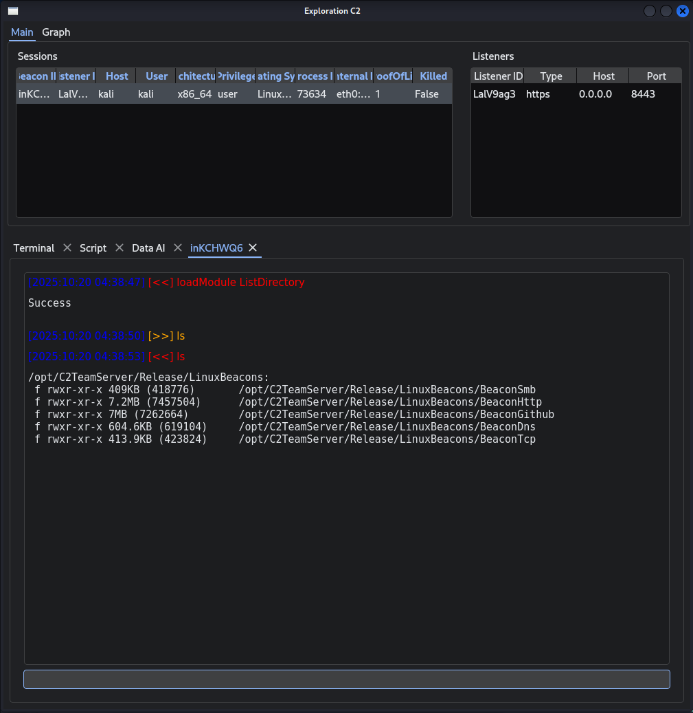

# Part 0 — Setup & Basic Usage

A short quickstart to get **C2TeamServer** running locally (raw binary or Docker) and connect the client. The steps below show how to:

* download the latest release,
* run the TeamServer (local or Docker),
* extract the mTLS certificate for the client,
* install & run the client.

> Prerequisites: `wget` / `curl`, `jq`, `tar`, `docker` (for the Docker section).

---

## 1.1 — Download the latest release (raw)

This fetches the latest `Release.tar.gz` from the repository’s GitHub releases and extracts it to `./C2TeamServer`:

```bash
# fetch latest Release.tar.gz and extract
wget -q "$(wget -q -O - 'https://api.github.com/repos/maxDcb/C2TeamServer/releases/latest' \
  | jq -r '.assets[] | select(.name=="Release.tar.gz").browser_download_url')" -O ./C2TeamServer.tar.gz

mkdir -p C2TeamServer
tar xf C2TeamServer.tar.gz -C C2TeamServer --strip-components=1

# verify
ls -lh C2TeamServer
total 36K
drwxr-xr-x 2 root root 4.0K Oct 20 04:29 LinuxBeacons
drwxr-xr-x 2 root root 4.0K Oct 20 04:29 LinuxModules
drwxr-xr-x 2 root root 4.0K Oct 16 07:33 Scripts
drwxr-xr-x 3 root root 4.0K Oct 20 04:29 TeamServer
drwxr-xr-x 2 root root 4.0K Oct 20 04:29 TeamServerModules
drwxr-xr-x 2 root root 4.0K Oct 16 07:33 Tools
drwxr-xr-x 2 root root 4.0K Oct 20 04:29 WindowsBeacons
drwxr-xr-x 2 root root 4.0K Oct 20 04:29 WindowsModules
drwxr-xr-x 2 root root 4.0K Oct 16 07:33 www

```

You should see a `TeamServer/` directory.

---

## 1.2 — Run the TeamServer locally

Change into the TeamServer directory and run the binary:

```bash
cd C2TeamServer/TeamServer
./TeamServer
```

Example startup log:

```
[2025-10-20 02:34:17.386] [TeamServer] [info] TeamServer logging initialized at info level
[2025-10-20 02:34:17.386] [TeamServer] [info] Authentication enabled for 2 user(s) using credentials file: auth_credentials.json
[2025-10-20 02:34:17.488] [TeamServer] [info] Loaded 37 TeamServer module(s) from ../TeamServerModules/
[2025-10-20 02:34:17.490] [TeamServer] [info] Team Server listening on 0.0.0.0:50051
```

> Notes:
>
> * Ensure the binary is executable (`chmod +x TeamServer`) and that any required shared libraries are present on your host.
> * If you hit libc / glibc incompatibilities, use the Docker option below (the Docker image packages a compatible runtime).

---

## 2.1 — Run via Docker

If you prefer containerized execution (recommended to avoid host library issues), build and run the official Dockerfile.

### Build the image

```bash
# fetch Dockerfile from repo (optional) and build
curl -sL https://raw.githubusercontent.com/maxDcb/C2TeamServer/refs/heads/master/Dockerfile -o Dockerfile
sudo docker build -t exploration-teamserver .
```

### Run the container (detached, with name)

Give the container a deterministic name for easy access:

```bash
sudo docker run -d --name teamserver \
  -p 50051:50051 -p 80:80 -p 443:443 -p 8443:8443 \
  exploration-teamserver
```

Example startup lines from the container:

```
[2025-10-20 08:14:57.313] [TeamServer] [info] TeamServer logging initialized at info level
[2025-10-20 08:14:57.314] [TeamServer] [warning] Failed to load ../TeamServerModules/libEnumerateShares.so
[2025-10-20 08:14:57.315] [TeamServer] [info] Loaded 36 TeamServer module(s) from ../TeamServerModules/
[2025-10-20 08:14:57.318] [TeamServer] [info] Team Server listening on 0.0.0.0:50051
```

#### If you want to inspect or persist files

* To access files generated inside the container (e.g., configs, logs), use a **named volume** or `docker cp`.
* Example: extract the built `Release` folder to the host (one-time) so you can modify/configure it:

```bash
# create a temporary container and copy Release out
CID=$(docker create exploration-teamserver)
sudo docker cp "$CID":/opt/teamserver/Release /opt/C2TeamServer
docker rm "$CID"

# then run with a bind mount if you want the host and container to share it:
sudo docker run -d --name teamserver \
  -v /opt/C2TeamServer:/opt/teamserver/Release \
  -p 50051:50051 -p 80:80 -p 443:443 -p 8443:8443 \
  exploration-teamserver
```

> Tip: Keep the first `docker create` + `docker cp` step if you want a host copy of the release content (binary + configs) to edit directly.

---

## 2.2 — Extract mTLS cert for the client

The client requires the server certificate (`server.crt`) to perform mTLS. If running in Docker, extract it from the running container:

```bash
# copy the server cert to host
sudo docker cp teamserver:/opt/teamserver/Release/TeamServer/server.crt ./

# then point the client to it:
export C2_CERT_PATH="$(pwd)/server.crt"
```

If you ran the server natively, `server.crt` is already in `C2TeamServer/TeamServer/` — adjust `C2_CERT_PATH` accordingly.

---

## 3 — Install & run the client

This project ships a Python client in the `C2Client` subdirectory. The example below uses `uv` ([UV astral](https://docs.astral.sh/uv/getting-started/installation/)) to install the client from the repository; you can also use `pip` or install from source if preferred.

```bash
# example with 'uv' (as used in the repo examples)
uv tool install git+https://github.com/maxDcb/C2TeamServer.git#subdirectory=C2Client

# set the path to the server certificate
export C2_CERT_PATH=/path/to/server.crt

# run the client
c2client
```

Startup output typically shows the client loading modules:

```
Cloning PeDropper ...
Successfully imported DreamWalkers
Successfully imported C2Client.Scripts.listDirectory
...
```

---

## Default credentials

The default admin credentials shipped for quick local tests:

```
admin:admin
```

---

## Troubleshooting & tips

* **Binary not found when mounting:** if you mount an **empty host folder** over `/opt/teamserver/Release`, you will hide the image content and the entrypoint will fail. Either:

  * copy the release out of the image first (`docker cp`) and mount that host folder, or
  * mount a specific subfolder (e.g., `logs`) instead of the entire `Release` path.
* **Permissions:** ensure `TeamServer` is executable (`chmod +x`).
* **Ports:** default gRPC port is `50051`; additional services may listen on `80`, `443`, `8443` depending on listeners setup, adjust with your needs.

---

## Example: full, reproducible flow (Docker + client)

```bash
# 1) Build
sudo docker build -t exploration-teamserver .

# 2) Create a host copy of the release
CID=$(sudo docker create exploration-teamserver)
sudo docker cp "$CID":/opt/teamserver/Release /opt/C2TeamServer
sudo docker rm "$CID"

# 3) Run container with host Release mounted (for easy editing)
sudo docker run -it --rm --name exploration-teamserver -v /opt/C2TeamServer/Release:/opt/teamserver/Release -p 50051:50051 -p 80:80 -p 443:443 -p 8443:8443 exploration-teamserver

# 4) Extract server cert for client use
export C2_CERT_PATH="/opt/C2TeamServer/Release/TeamServer/server.crt"

# 5) Install & run client
uv tool install git+https://github.com/maxDcb/C2TeamServer.git#subdirectory=C2Client
c2client
```

At the start of the client, some basic script are executed, to launch a listener in port 8443 and loadmodule ListDirectory in case of beacon connection.


---

## Visual


---

## 4 — First beacon

Linux beacon binaries are located in `Release/LinuxBeacons`. If you previously extracted the release from the Docker image to your host (see earlier steps), the beacon binary is ready to run from that path. Otherwise, copy the `BeaconHttp` binary from the container to your host before running it.

### Run the HTTP beacon (local test)

```bash
# go to the extracted release folder
cd /opt/C2TeamServer/Release/LinuxBeacons

# make sure the binary is executable
chmod +x BeaconHttp

# run the beacon and point it to the TeamServer
./BeaconHttp 127.0.0.1 8443 https
```

* `127.0.0.1` — TeamServer host (replace with TeamServer IP or hostname when remote).
* `8443` — port configured for the HTTP(s) listener (adjust if your listener uses another port).
* `https` — protocol; use `http` only for local/insecure tests.


---


*Example: a successful HTTP beacon registration shown in the TeamServer console.*

---

## Next

[Part 1 — TeamServer & Architecture](./Part1TeamServerAndArchitecture.md).  
[Part 2 — GUI](./Part2Gui.md).  
[Part 3 — Beacons And Listeners](./Part3BeaconsAndListeners.md).  
[Part 4 — Modules](./Part4Modules.md).  