# Part 2 - GUI

This is **Part 2** of a short series on **ExplorationC2** — a modular Command-and-Control framework I maintain at `https://github.com/maxDcb/C2TeamServer`.
In this post I describe the **GUI**: how it’s structured, how it talks to the TeamServer in a pull model, and how panels and modules fit together.

---

## 🧭 High-Level Goals


**Source:** `https://github.com/maxDcb/C2TeamServer/tree/master/C2Client/C2Client`

Files of interest:

```bash
# Core of GUI
GUI.py
AssistantPanel.py
ConsolePanel.py
GraphPanel.py
ListenerPanel.py
ScriptPanel.py
SessionPanel.py
TerminalPanel.py

# Config files
DropperModules.conf
ShellCodeModules.conf

# Working Directories
DropperModules
Scripts
ShellCodeModules
TerminalModules

# Terminal and sessions logs
logs
```

## Overview

The client is a QT6 **Python** desktop application that connects to the TeamServer (via gRPC) and exposes common operator workflows through dedicated panels. The GUI is intentionally **modular**: panels are kept small and focused, and operator tooling (like dropper/shellcode generators) is surfaced via simple configuration files (`DropperModules.conf`, `ShellCodeModules.conf`) so you can grow features without touching the core.

## High-level architecture

```text
+--------------------+           gRPC            +--------------------+
|   GUI QT6 Python   |  <--------------------->  |     TeamServer     |
|  - GUI.py          |                           |     (listeners)    |
|  - *Panel.py       |                           +----------+---------+
|  - *Modules.conf   |                                     |
+----------+---------+                                     |
                                                           |
                                                 +---------v---------+
                                                 |     Listeners     |
                                                 | (HTTP/HTTPS/…)    |
                                                 +---------+---------+
                                                           |
                                                           |
                                                           |
                                                           v
                                                        Beacons
```

**Pull model:** The client pulls information from the TeamServer, including beacon, listener, and session status, using gRPC.

All panels that need to communicate with the TeamServer implement a `GrpcClient`. It uses mTLS, so a certificate needs to be provided using the `C2_CERT_PATH` environment variable. Login is performed using a username and password.

```python
class GrpcClient:
    """Thin wrapper around the gRPC TeamServer API client.

    Parameters
    ----------
    ip:
        IP address of the TeamServer.
    port:
        Port exposed by the TeamServer.
    username:
        Username to authenticate with. If omitted, environment variables are used.
    password:
        Password to authenticate with. If omitted, environment variables are used.
    """

    def __init__(
        self,
        ip: str,
        port: int,
        devMode: bool,
        token: Optional[str] = None,
        username: Optional[str] = None,
        password: Optional[str] = None,
    ) -> None:
        env_cert_path = os.getenv('C2_CERT_PATH')

...

#
# Consoles Tab Implementation
#
class ConsolesTab(QWidget):

    def __init__(self, parent, grpcClient):
        ...
```


---

## Entry point

**`GUI.py`** — main application bootstrap. It wires up the window, registers panels, and initializes the client connection. This is where new panels are typically added to the main layout or tabset.

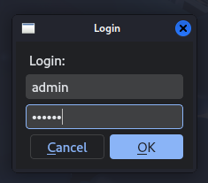

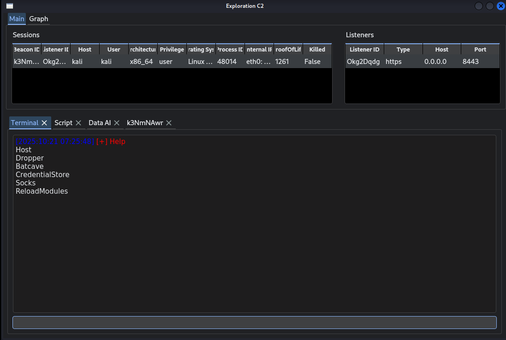

---

## ListenerPanel

**`ListenerPanel.py`**
  Manages and inspects listeners (type, bind address/port, status, etc.). It’s the natural place to surface "addListener / getListeners / stopListener" actions and to show what endpoints are currently serving beacons.

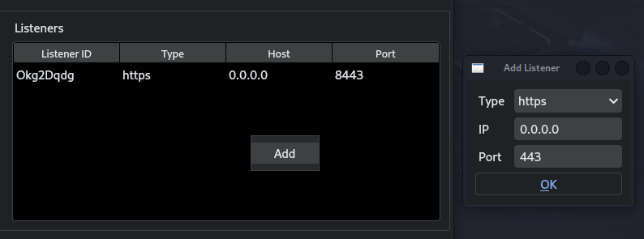

---

## SessionPanel

**`SessionPanel.py`**
  Views active sessions (beacons) and their key attributes (e.g., target host, pid, privilege, arch, last check-in). The main features are interact / stop / delete. You can only delete a beacon that has already been stopped; it will remove it from the GUI.

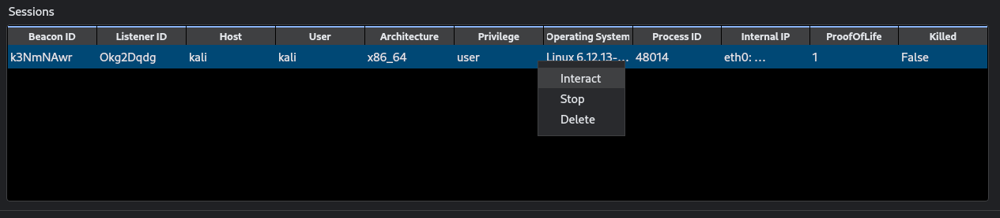

---

## TerminalPanel

**`TerminalPanel.py`**
  A general operator console for TeamServer-level actions. Useful for hosting files for download, generating droppers for beacon delivery, installing tools on the TeamServer, managing SOCKS5, and finally triggering a server-side `reloadModule`.


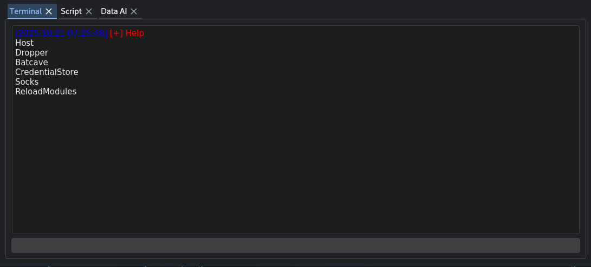

Its power comes from the same **config-driven modularity** used elsewhere in the client: the **dropper** and **shellcode** builders are populated from `DropperModules.conf` and `ShellCodeModules.conf`, so new generators show up in the panel without touching core code.

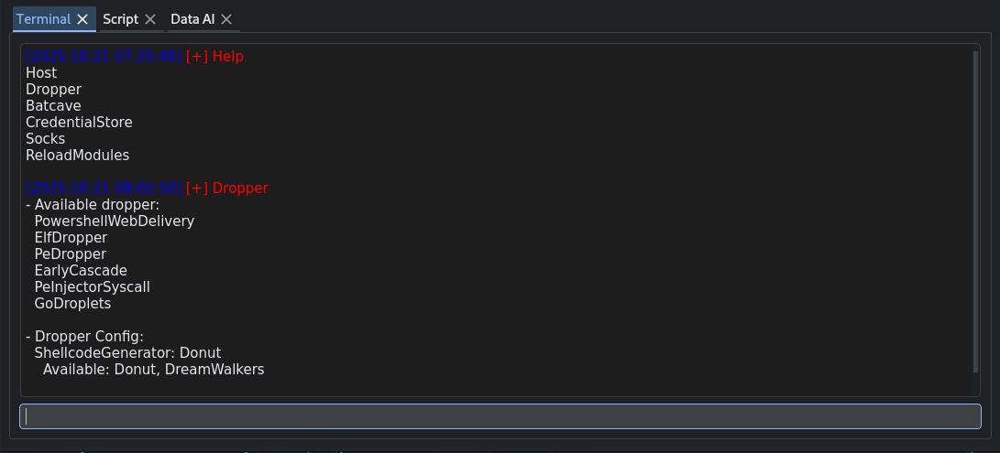

```text
https://github.com/maxDcb/PeDropper
https://github.com/maxDcb/PowershellWebDelivery
https://github.com/maxDcb/PeInjectorSyscall
https://github.com/almounah/GoDroplets.git
https://github.com/maxDcb/ElfDropper.git
https://github.com/maxDcb/EarlyCascade.git
```
*DropperModules.conf*

``` python
#
# Dropper modules
#
dropperModulesDir = 'DropperModules'
DropperModulesPath = 'DropperModules.conf'

with open(DropperModulesPath, "r") as file:
    repositories = file.readlines()

# Clone modules in DropperModulesPath file in dropperModulesDir
DropperModules = []
for repo in repositories:
    repo = repo.strip()
    repoName = repo.split('/')[-1].replace('.git', '')
    repoPath = os.path.join(dropperModulesDir, repoName)

    if not os.path.exists(repoPath):
        print(f"Cloning {repoName} in {repoPath}.")
        Repo.clone_from(repo, repoPath)

# Fill DropperModules with available droppers, from dropperModulesDir directory
for moduleName in os.listdir(dropperModulesDir):
    modulePath = os.path.join(dropperModulesDir, moduleName)

    if os.path.isdir(modulePath):
        if os.path.exists(modulePath):
            sys.path.insert(1, modulePath)

            # Dynamically import the module
            importedModule = __import__(moduleName)
            DropperModules.append(importedModule)
            print(f"Successfully imported {moduleName}")

....

# Generate the payload - using the special "generatePayloadsExploration" function exposed by the module
for module in DropperModules:
    if self.moduleName == module.__name__.lower():
        logging.debug("GenerateAndHostGeneric DropperModule: %s", self.moduleName)

          genPayload = getattr(module, "generatePayloadsExploration")
          droppersPath, shellcodesPath, cmdToRun = genPayload(beaconFilePath, beaconArg, rawshellcode, urlDownload, self.additionalArgs.split(" "))
```

In the same spirit, **Terminal modules** act like pluggable actions you can run against the active session (e.g., one-shot helpers, mini-workflows). They need more integration and work should often be done client and server side but it keeps the UI thin while letting you grow capabilities by adding Python modules and minimal modifications.

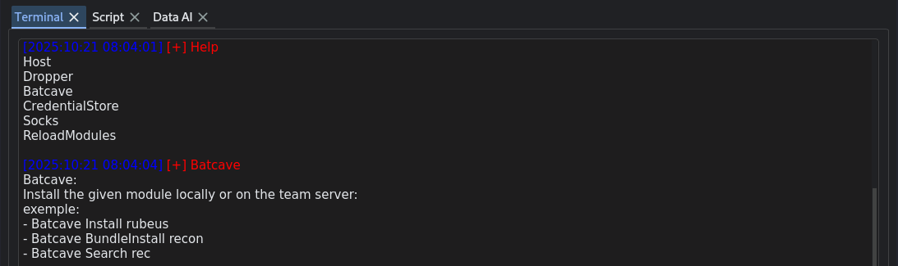
*Batcave lets you install new tools from a GitHub organization directly on the TeamServer.*

```bash
└─$ ll TerminalModules
total 12
drwxrwxr-x+ 4 kali kali 4096 Oct 16 07:14 Batcave
drwxrwxr-x+ 3 kali kali 4096 Oct 16 07:14 Credentials

┌──(kali㉿kali)-[~/…/framework/C2TeamServer/C2Client/C2Client]
└─$ ll TerminalModules/Batcave
total 16
-rw-rwx---+ 1 kali kali 4505 Oct 16 07:14 batcave.py
```

Minimal implementation needs to be done client-side and sometimes server-side:

```python
# import new module
from .TerminalModules.Batcave import batcave

#
# Implementation of the new Batcave module in TerminalPanel.py
#
def runBatcave(self, commandLine, instructions):
    ...

    if cmd == "Install".lower():
    ...

    elif cmd == "BundleInstall".lower():
    ...
```

---

## ConsolePanel

**`ConsolePanel.py`**
  An interactive command view scoped to a selected session (e.g., run a task against a beacon, see task result and errors). This is typically where you “live” during hands-on work.
  The console tries its best to provide auto-completion for common commands. It pulls the results every second. If multiple GUI clients are connected to the same session, they all receive the output results.

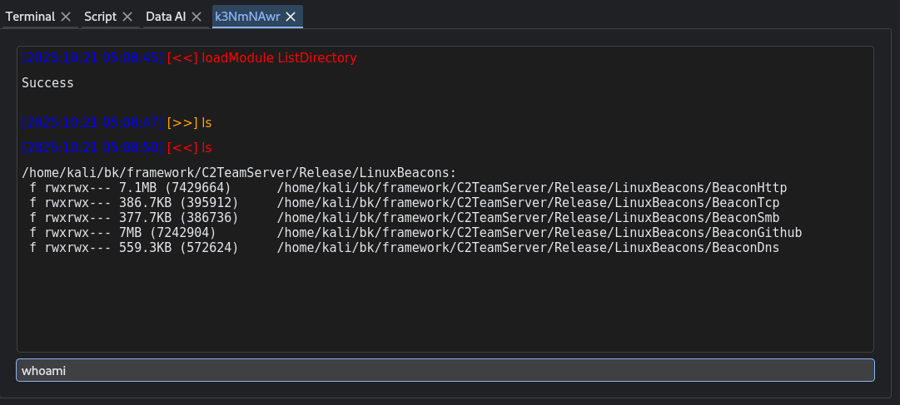

---

## ScriptPanel


**`ScriptPanel.py`**
  Displays logs for startup scripts running against sessions or the server. Good for repeatable actions and small automations without rebuilding the client.

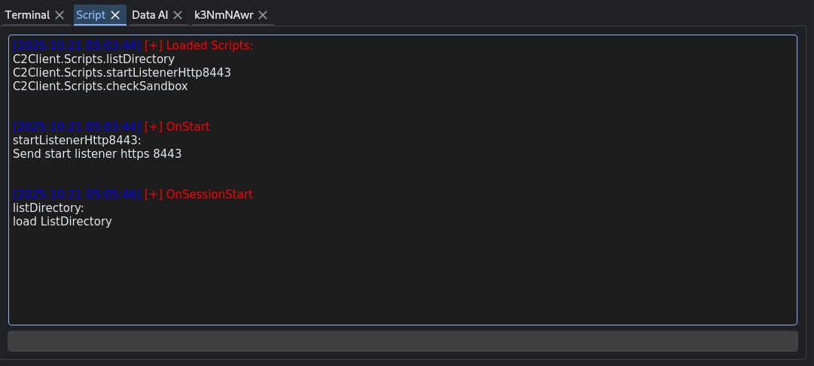

In the GUI, **scripts are loaded from `C2Client/Scripts` and plugged into lifecycle hooks** so they can react to operator activity without changing core code. Each script module can implement: `OnStart` / `OnStop` (run when the client starts/stops), `OnListenerStart` / `OnListenerStop` (react to listener lifecycle), `OnSessionStart` / `OnSessionUpdate` / `OnSessionStop` (triggered as beacons/sessions appear, change, or die—receiving details like `beaconHash`, `listenerHash`, `hostname`, `username`, `arch`, `privilege`, `os`, timestamps, etc.), and `OnConsoleSend` / `OnConsoleReceive` (to observe or augment console traffic). All hooks receive the active `grpcClient`, letting scripts call TeamServer APIs directly. The panel auto-discovers `.py` files in `C2Client/Scripts`, imports them, and lists the loaded scripts in the UI.

Example of a script that loads a module and uses it at session start:

```python
from ..grpcClient import TeamServerApi_pb2


def OnSessionStart(grpcClient, beaconHash, listenerHash, hostname, username, arch, privilege, os, lastProofOfLife, killed):
	output = "listDirectory:\n";
	output += "load ListDirectory\n";

	commandLine = "loadModule ListDirectory"
	command = TeamServerApi_pb2.Command(beaconHash=beaconHash, listenerHash=listenerHash, cmd=commandLine)
	result = grpcClient.sendCmdToSession(command)

	commandLine = "ls"
	command = TeamServerApi_pb2.Command(beaconHash=beaconHash, listenerHash=listenerHash, cmd=commandLine)
	result = grpcClient.sendCmdToSession(command)

	return output
```

---


## GraphPanel


**`GraphPanel.py`**
  A visual summary of relationships (e.g., listeners ↔ sessions). This panel helps you spot topology, fan-out, and which endpoints or hosts are most active. It’s especially handy as operations grow.

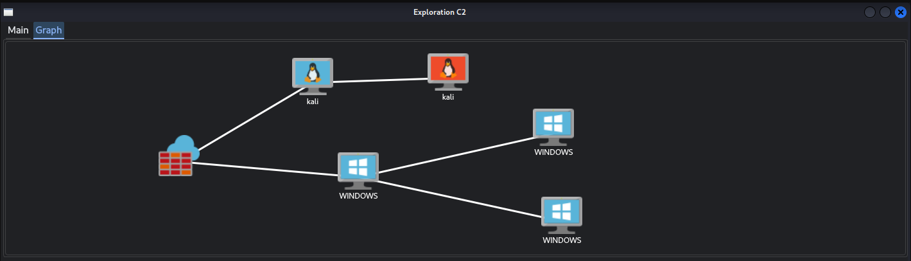

---


## AssistantPanel


**`AssistantPanel.py`**
  A self-contained panel that embeds an **OpenAI-backed agent** into the GUI. It gives you a chat-style workspace for operator aids (drafting commands, summarizing results, or brainstorming next steps). The panel talks to OpenAI directly (using your configured API key settings) and, when relevant, can reference the current context (e.g., selected session or recent console output). It has access to multiple functions that it can use to interact with sessions.
  **Without a provided API key, the functionality is disabled.**

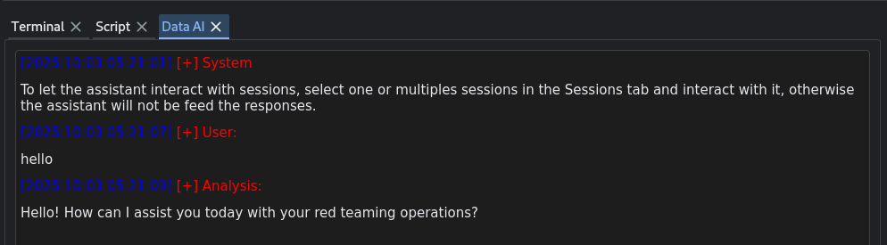
*Init.*

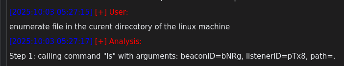
*Ask for a task needing a command to be run.*


```python
import openai
from openai import OpenAI

...

# Init the client with OPENAI API KEY
api_key = os.environ.get("OPENAI_API_KEY")
if not api_key:
    self.printInTerminal("System", "OPENAI_API_KEY is not set, functionality deactivated.")
else:
    self.printInTerminal("System", "To let the assistant interact with sessions, select one or multiple sessions in the Sessions tab and interact with it; otherwise the assistant will not be fed the responses.")

client = OpenAI(api_key=api_key)

...

# Send OpenAI a question
response = client.chat.completions.create(
            model="gpt-4o",
            messages=messages_snapshot,
            functions=self._function_specs(),
            function_call="auto",
            temperature=0.05,
        )

# Supported functions available to the agent to run freely
def executeCmd(self, cmd, args):
        supported_commands = {
            "loadModule",
            "ls",
            "tree",
            "cd",
            "cat",
            "pwd",
            "download",
            "upload",
            "enumerateShares",
            "getEnv",
            "ipConfig",
            "killProcess",
            "listProcesses",
            "netstat",
            "remove",
            "run",
            "whoami",
        }

# When a response is received in an open console
def consoleAssistantMethod(self, action, beaconHash, listenerHash, context, cmd, result):
    if action != "receive":
        return

    command_text = cmd or ""
    display_output = result or ""

    if awaiting_result:

        function_name = self.pending_tool_name or "unknown"
        self.messages.append({"role": "function", "name": function_name, "content": display_output})

        # Keep the memory of the AI small ~ 20 messages
        self._trim_message_history()

        # Keep the number of commands the agent can run on its own < 10
        self.tool_call_count += 1

        # Send a message to OpenAI in a thread
        self._request_assistant_response()
```

---

## What’s next

- [Part 3 - Beacons and Listeners](./Part3BeaconsAndListeners.html)
- [Part 4 - Modules](./Part4Modules.html)
