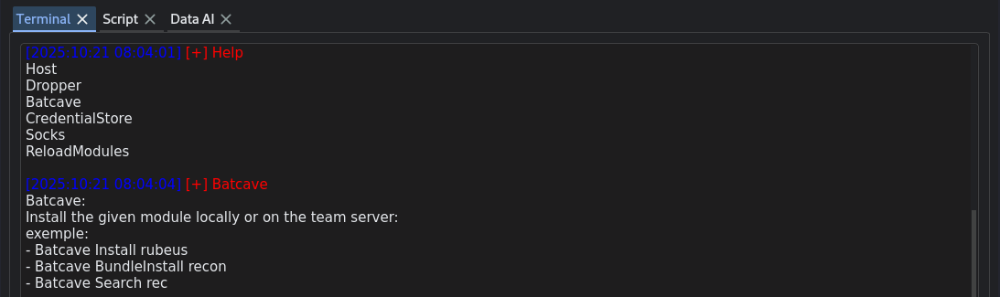
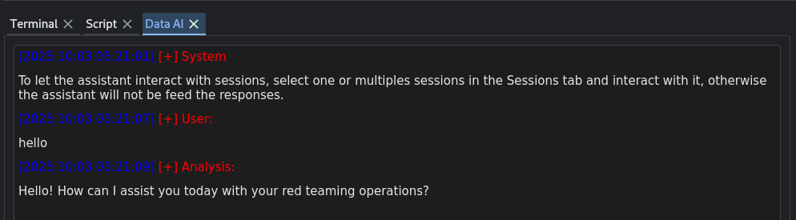

# Part 2 — GUI

This is **Part 2** of a short series on **ExplorationC2** — a modular Command-and-Control framework I maintain at `https://github.com/maxDcb/C2TeamServer`.
In this post I describe the **GUI**: how it’s structured, how it talks to the TeamServer in a pull model, and how panels and modules fit together.

---

## 🧭 High-Level Goals


**Source:** `https://github.com/maxDcb/C2TeamServer/tree/master/C2Client/C2Client`

Files of interest:

```bash
# Core of GUI
GUI.py
AssistantPanel.py
ConsolePanel.py
GraphPanel.py
ListenerPanel.py
ScriptPanel.py
SessionPanel.py
TerminalPanel.py

# Config files
DropperModules.conf
ShellCodeModules.conf

# Working Directories
DropperModules
Scripts
ShellCodeModules
TerminalModules

# Terminal and sessions logs
logs
```

## Overview

The client is a QT6 **Python** desktop application that connects to the TeamServer (via gRPC) and exposes common operator workflows through dedicated panels. The GUI is intentionally **modular**: panels are kept small and focused, and operator tooling (like dropper/shellcode generators) is surfaced via simple configuration files (`DropperModules.conf`, `ShellCodeModules.conf`) so you can grow features without touching the core.

## High-level architecture

```text
+--------------------+           gRPC            +--------------------+
|   GUI QT6 Python   |  <--------------------->  |     TeamServer     |
|  - GUI.py          |                           |     (listeners)    |
|  - *Panel.py       |                           +----------+---------+
|  - *Modules.conf   |                                     |
+----------+---------+                                     |
                                                           |
                                                 +---------v---------+
                                                 |     Listeners     |
                                                 | (HTTP/HTTPS/…)    |
                                                 +---------+---------+
                                                           |
                                                           |
                                                           |
                                                           v
                                                        Beacons
```

**Pull model:** Client pull the informations from the TeamServer, beacons, listener and sessions status using gRPC.  

All panels that need to communicate with the TeamServer implement a GrpcClient. It uses mTLS so a certificat need to be provided using C2_CERT_PATH env variable. A login is performe using username/password.

```python
class GrpcClient:
    """Thin wrapper around the gRPC TeamServer API client.

    Parameters
    ----------
    ip:
        IP address of the TeamServer.
    port:
        Port exposed by the TeamServer.
    username:
        Username to authenticate with. If omitted, environment variables are used.
    password:
        Password to authenticate with. If omitted, environment variables are used.
    """

    def __init__(
        self,
        ip: str,
        port: int,
        devMode: bool,
        token: Optional[str] = None,
        username: Optional[str] = None,
        password: Optional[str] = None,
    ) -> None:
        env_cert_path = os.getenv('C2_CERT_PATH')

...

#
# Consoles Tab Implementation
#
class ConsolesTab(QWidget):
    
    def __init__(self, parent, grpcClient):
        ...
```


---

## Entry point

**`GUI.py`** — main application bootstrap. It wires up the window, registers panels, and initializes the client connection. This is where new panels are typically added to the main layout or tabset.


---

## ListenerPanel

**`ListenerPanel.py`**
  Manage/inspect listeners (type, bind address/port, status, etc.). It’s the natural place to surface "addListener / getListeners / stopListener” actions and to show what endpoints are currently serving beacons.


---

## SessionPanel

**`SessionPanel.py`**
  View active sessions (beacons) and their key attributes (e.g., target host, pid, privilege, arch, last check-in). The main features are interact / Stop / Delete. You can only delete a beacon already stoped, it will remove it from the GUI.


---

## TerminalPanel

**`TerminalPanel.py`**
  A general operator console for TeamServer-level actions. Useful for hosting files for download, generating dropper for beacon delivery, install tools on the TeamServer, manage the socks5 and finaly trigger a reloadModule server side.


Its power comes from the same **config-driven modularity** used elsewhere in the client: the **dropper** and **shellcode** builders are populated from `DropperModules.conf` and `ShellCodeModules.conf`, so new generators show up in the panel without touching core code.   


```text
https://github.com/maxDcb/PeDropper
https://github.com/maxDcb/PowershellWebDelivery
https://github.com/maxDcb/PeInjectorSyscall
https://github.com/almounah/GoDroplets.git
https://github.com/maxDcb/ElfDropper.git
https://github.com/maxDcb/EarlyCascade.git
```  
*DropperModules.conf*

``` python
#
# Dropper modules
#
dropperModulesDir = 'DropperModules' 
DropperModulesPath = 'DropperModules.conf'  

with open(DropperModulesPath, "r") as file:
    repositories = file.readlines()

# Clone modules in DropperModulesPath file in dropperModulesDir
DropperModules = []
for repo in repositories:
    repo = repo.strip()
    repoName = repo.split('/')[-1].replace('.git', '')
    repoPath = os.path.join(dropperModulesDir, repoName)

    if not os.path.exists(repoPath):
        print(f"Cloning {repoName} in {repoPath}.")
        Repo.clone_from(repo, repoPath)

# Fill DropperModules with available droppers, from dropperModulesDir directory
for moduleName in os.listdir(dropperModulesDir):
    modulePath = os.path.join(dropperModulesDir, moduleName)
    
    if os.path.isdir(modulePath):
        if os.path.exists(modulePath):
            sys.path.insert(1, modulePath)

            # Dynamically import the module
            importedModule = __import__(moduleName)
            DropperModules.append(importedModule)
            print(f"Successfully imported {moduleName}")

....

# Generate the payload - using the special "generatePayloadsExploration" function exposed by the module
for module in DropperModules:
    if self.moduleName == module.__name__.lower():
        logging.debug("GenerateAndHostGeneric DropperModule: %s", self.moduleName)

          genPayload = getattr(module, "generatePayloadsExploration")
          droppersPath, shellcodesPath, cmdToRun = genPayload(beaconFilePath, beaconArg, rawshellcode, urlDownload, self.additionalArgs.split(" "))
```

In the same spirit, **Terminal modules** act like pluggable actions you can run against the active session (e.g., one-shot helpers, mini-workflows). They need more integration and work should often be done client and server side but it keeps the UI thin while letting you grow capabilities by adding Python modules and minimal modifications.

  
*Batcave let you install new tools from a github organisation directly on the TeamServer.*

```bash
└─$ ll TerminalModules                                                                         
total 12
drwxrwxr-x+ 4 kali kali 4096 Oct 16 07:14 Batcave
drwxrwxr-x+ 3 kali kali 4096 Oct 16 07:14 Credentials
                                                                                                                                                                                                                                            
┌──(kali㉿kali)-[~/…/framework/C2TeamServer/C2Client/C2Client]
└─$ ll TerminalModules/Batcave 
total 16
-rw-rwx---+ 1 kali kali 4505 Oct 16 07:14 batcave.py
```

Minimal implementation need to be done client side and some time server side:

```python
# import new module
from .TerminalModules.Batcave import batcave

#
# Impleme of the new Batcave module in the TerminalPanel.py
# 
def runBatcave(self, commandLine, instructions):
    ...

    if cmd == "Install".lower():
    ...  

    elif cmd == "BundleInstall".lower():
    ...  
```

---

## ConsolePanel

**`ConsolePanel.py`**
  An interactive command view scoped to a selected session (e.g., run a task against a beacon, see task result and errors). This is typically where you “live” during hands-on work.  
  The console try it's best to provide an auto completion for usual commands. It pull the results every seconds. If mutliple GUI are connected to the same session, they all receive the output results.


---

## ScriptPanel


**`ScriptPanel.py`**
  Display that shown logs about start scripts running against sessions or the server. Good for repeatable actions and small automations without rebuilding the client.


In the GUI, **scripts are loaded from `C2Client/Scripts` and plugged into lifecycle hooks** so they can react to operator activity without changing core code. Each script module can implement: `OnStart` / `OnStop` (run when the client starts/stops), `OnListenerStart` / `OnListenerStop` (react to listener lifecycle), `OnSessionStart` / `OnSessionUpdate` / `OnSessionStop` (triggered as beacons/sessions appear, change, or die—receiving details like `beaconHash`, `listenerHash`, `hostname`, `username`, `arch`, `privilege`, `os`, timestamps, etc.), and `OnConsoleSend` / `OnConsoleReceive` (to observe or augment console traffic). All hooks receive the active `grpcClient`, letting scripts call TeamServer APIs directly. The panel auto-discovers `.py` files in `C2Client/Scripts`, imports them, and lists the loaded scripts in the UI.

Example of a script that load a module and use it at session start:

```python
from ..grpcClient import TeamServerApi_pb2


def OnSessionStart(grpcClient, beaconHash, listenerHash, hostname, username, arch, privilege, os, lastProofOfLife, killed):
	output = "listDirectory:\n";	
	output += "load ListDirectory\n";	

	commandLine = "loadModule ListDirectory"
	command = TeamServerApi_pb2.Command(beaconHash=beaconHash, listenerHash=listenerHash, cmd=commandLine)
	result = grpcClient.sendCmdToSession(command)
	
	commandLine = "ls"
	command = TeamServerApi_pb2.Command(beaconHash=beaconHash, listenerHash=listenerHash, cmd=commandLine)
	result = grpcClient.sendCmdToSession(command)

	return output
```

---


## GraphPanel


**`GraphPanel.py`**
  A visual summary of relationships (e.g., listeners ↔ sessions). This panel helps you spot topology, fan-out, and which endpoints or hosts are most active. It’s especially handy as operations grow.


---


## AssistantPanel


**`AssistantPanel.py`**
  is a self-contained panel that embeds an **OpenAI-backed agent** into the GUI. It gives you a chat-style workspace for operator aids (drafting commands, summarizing results, or brainstorming next steps). The panel talks to OpenAI directly (using your configured API key settings) and, when relevant, can reference the current context (e.g., selected session or recent console output). It has access to multiples fonction that it can use to intereact with sessions.  
  **Without a provided API key the functionaly is disabled.**

  
*Init.*

  
*Ask for a task needing a command to be run.*


```python
import openai
from openai import OpenAI

...

# Init the client with OPENAI API KEY
api_key = os.environ.get("OPENAI_API_KEY")
if not api_key:
    self.printInTerminal("System", "OPENAI_API_KEY is not set, functionality deactivated.")
else:
    self.printInTerminal("System", "To let the assistant interact with sessions, select one or multiples sessions in the Sessions tab and interact with it, otherwise the assistant will not be feed the responses.")

client = OpenAI(api_key=api_key)

...

# Send openAI a question
response = client.chat.completions.create(
            model="gpt-4o",
            messages=messages_snapshot,
            functions=self._function_specs(),
            function_call="auto",
            temperature=0.05,
        )

# Supported function available to the agent to run freely
def executeCmd(self, cmd, args):
        supported_commands = {
            "loadModule",
            "ls",
            "tree",
            "cd",
            "cat",
            "pwd",
            "download",
            "upload",
            "enumerateShares",
            "getEnv",
            "ipConfig",
            "killProcess",
            "listProcesses",
            "netstat",
            "remove",
            "run",
            "whoami",
        }

# When a response is received in an opened consol
def consoleAssistantMethod(self, action, beaconHash, listenerHash, context, cmd, result):
    if action != "receive":
        return

    command_text = cmd or ""
    display_output = result or ""

    if awaiting_result:

        function_name = self.pending_tool_name or "unknown"
        self.messages.append({"role": "function", "name": function_name, "content": display_output})

        # Keep the memory of the AI small ~ 20 messages
        self._trim_message_history()

        # Keep the number of command agent can run on it's own < 10
        self.tool_call_count += 1

        # Send a message to OpenAI in a thread
        self._request_assistant_response()
```

---

## What’s next

TODO