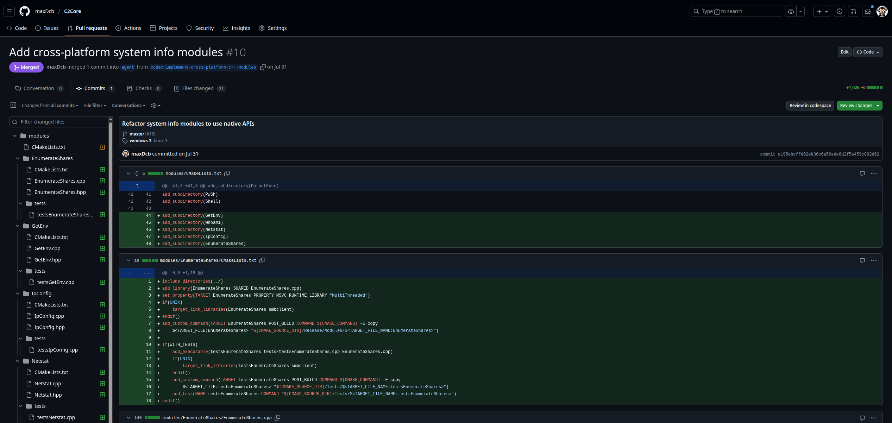

# My Journey with Codex

## What is this codex stuff about ?

A long time ago, I followed Andrew Ng’s course on machine learning. At that time, my goal was to distinguish what was genuinely achievable with “AI” from what was closer to science fiction.

My conclusion was clear: machine learning was a powerful tool, but only for specific domains—namely, problems where no established scientific formula or straightforward algorithm could be applied, and where vast amounts of data were available. For the majority of applications, its utility seemed rather limited.

When ChatGPT appeared, my curiosity was reignited: the internet is full of natural language and code, so this was exactly the kind of problem ML could solve.

After experimenting with it for several months and exploring the OpenAI API, I eventually subscribed to ChatGPT Plus. Only then did I discover the Codex feature, which I had not even heard about before.
When I first experimented with Codex, my approach was naïve: I simply threw my entire codebase at it and waited for something magical to happen. Spoiler: it didn’t. The results were inconsistent and often not very useful.

My very first prompts was:


The actual outputs were not especially valuable. What truly fascinated me, however, was observing the agent’s log. Codex issued system commands that were sometimes unintentionally amusing—for instance, commands to read a portion of a file:


It even explained its reasoning along the way, with lines such as: “I’ll take a look at the config JSON file now.” And when I issued a “code” query, Codex concluded by summarizing its work in the form of a proposed pull request.
The moment that truly struck me, however, was when it attempted the following:

``` bash
cmake .. 
(failed to configure because the command conan_cmake_configure was not found)
```

It had, in fact, attempted to compile the project—only to fail because the build environment was not properly set up.

That was the turning point. I realized that if I wanted Codex to be truly useful, I first had to prepare the environment and make the task achievable. The reasoning was straightforward: **if Codex can compile and test its own code, it will iterate until the task is successfully completed.**

## Reshaping my scope

To obtain meaningful results, I reshaped my approach by focusing on the most important part of my codebase: C2Core. Although it was not originally designed to be compiled on its own, this repository contained the most algorithmically intensive components of my projects.

My objective was twofold:
- Self-buildable – so that Codex could compile it without requiring manual fixes.
- Testable – so that suggestions could be validated quickly through clear pass/fail outcomes.

After achieving the first step, I asked Codex to generate primarily tests and the necessary structure to compile and run them, thereby accomplishing the second step.

A very important component of the project is actually the AGENT.md file, which Codex will try to read every time.


This shift made a decisive difference. From that point onward, Codex’s tasks took longer but consistently produced code that not only compiled but also executed successfully.

The lesson was clear: when Codex is given the opportunity to test its own work, it iteratively corrects itself and produces far more accurate results. In short, **it simply needs a feedback loop.**

## The Power of Templates

Another major breakthrough came when I realized how much Codex benefits from templates. The insight emerged while reviewing logs, where I noticed a message along the lines of: “reading this file to see how this is done.”

This led me to experiment with providing Codex explicit templates as starting points. The results were remarkable. One of the most striking examples was when Codex successfully generated multiple libraries, starting from the following prompt:
You are a C++ expert working on a cross-platform C2 framework.

``` 
Code the following modules:
GetEnv 
Whoami 
Netstat 
IpConfig 
EnumerateShares 

Each moduleName must start with lowercase, and follow the existing module format.

Requirements:

The modules must work on both Windows and Linux platforms but do not need to use the same code necessarly.
You may use platform-specific code (e.g., #ifdef _WIN32) as needed.
Output formats don't need to match across platforms, but must be functional.
Use ModuleTemplate and Cat as structural references for the modules (class declaration, process() method, etc.).
Implement each module inside a class with the same name as the module, inheriting from the base ModuleCmd.

Testing:
For each module, provide a valid test implementation using the testing conventions already in place.

Functional expectations:
getEnv: List environment variables.
whoami: Print current user, the groups and available information about the user.
netstat: Show active network connections.
ipConfig: Show local IP configuration.
enumerateShares: List available SMB shares (use net view \\host or equivalent on Windows, and smbclient -L or smbtree on Linux).

Make the modules clean, modular, and follow the style of existing modules in the modules/ModuleCmd directory.
```

The first result was kind of funny, because it gave me an implementation using the system tools, like launching whoami.exe and after issuing the following prompt:

```
Ok it's a good start but what I want it that you use native api call for windows, not to use third partie program like whoami or ipconfig or netstat, use the windows API calls available to perform the enumeration. Same for linux use c/c++ cmd or syscall.
```

The results were highly convincing, as illustrated in the corresponding pull request:

[Codex PR](https://github.com/maxDcb/C2Core/pull/10/commits)



My conclusion was straightforward: **the more guidance you provide, the better the results.**

## The Windows vs. Ubuntu Challenge

One of the main difficulties I encountered was the mismatch between platforms. 

My project included Windows modules, whereas Codex operated within an Ubuntu environment. As a result, the code it produced was generally “almost correct” but consistently required manual adjustments to compile and run properly on Windows. This experience reinforced my intuition that, without a feedback loop, Codex is significantly less effective.

Interestingly, this also highlighted a very human-like method in the way Codex “codes.” Its approach resembled my own: write a substantial portion of code, attempt to compile, identify the errors, and then correct them iteratively.

## Lessons from libDNS

After achieving good results in the C2Core repository, I was eager to apply Codex more broadly. One project that I wanted to come back to was an older one I had not touched for some time: libDnsCommunication, a C++ library for DNS-based message tunneling. My goal was to extend it by supporting multiple concurrent sessions and improving overall robustness.

I began with a simple request: adding logging to facilitate debugging. Encouraged by the results, I quickly moved to more feature-oriented tasks. Codex did provide suggestions, but because the original codebase was poorly structured, its contributions ultimately made the project more disorganized. 


Rather than introducing the architectural clarity that was needed, Codex kept patching issues and layering incremental fixes.

In the end, I had to manually rebuild a clean architecture before real progress could be made. 


The conclusion was straightforward:
- If the foundation is solid, Codex accelerates progress.
- If the foundation is weak, Codex amplifies the chaos.

## Conclusion

The potential of Codex-like agents is immense, provided they are given the right conditions to succeed. 

I now use Codex particularly during idle moments—such as while commuting or during breaks to explore tasks I might otherwise have postponed, or to test new ideas that help clarify my perspective.

```
You are a GUI expert. Take a look at C2Client, which is a GUI coded in Python, and propose the best language replacement if I had to build it from scratch in another language. Also, assess the time that would be necessary.
```

Its greatest advantage lies in the fact that one is never compelled to adopt its suggestions: Codex continuously proposes, but the final decision remains ours.

Rather than serving as a replacement for development, Codex functions as a force multiplier. It enhances my capabilities, creating the sense that I am no longer working alone but instead leading a small, tireless development team.
