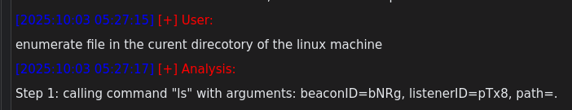

# Data my C2 agent

After experimenting with Codex for some time, I implemented an agent for my [C2 framework](https://github.com/maxDcb/C2TeamServer).


I already use the OpenAI API for experiments, so it was the natural first choice for prototyping. However, the architecture and principles presented here are platform-agnostic.

## First step

The initial change was minimal: add a new tab dedicated to agent ↔ API communication. A simple curl request would suffice, but OpenAI provides an official Python client that simplifies integration:

``` python
from openai import OpenAI
import os

# create client (it reads OPENAI_API_KEY from env by default)
client = OpenAI()

resp = client.chat.completions.create(
    model="gpt-4o-mini",
    messages=[{"role": "user", "content": "Hello"}],
)

print(resp.choices[0].message["content"])
```


Messages are JSON-formatted objects that contain a role and a content field. One important detail is that the OpenAI chat API is stateless: you must manage conversation memory yourself. To provide context for a query, include the relevant messages in the messages array. The system prompt should always be the first message in the stack:

```python
system_prompt = {
            "role": "system",
            "content": (
                """You are a Red Team Operator Assistant...."""
)
        }
```

## Giving the AI legs

To allow the agent to invoke C2 functions, some plumbing was required. The underlying mechanism uses the OpenAI "functions" feature to declare available capabilities:

```python

def _function_specs(self):
    function_spec_ls = {
        "name": "ls",
        "description": "List the contents of a specified directory on a specific beacon.",
        "parameters": {
            "type": "object",
            "properties": {
                "beacon_hash": {
                    "type": "string",
                    "description": "The unique hash identifying the beacon to execute the command on"
                },
                "listener_hash": {
                    "type": "string",
                    "description": "The unique hash identifying the listener at which the beacon is connected"
                },
                "path": {
                    "type": "string",
                    "description": "The path of the directory to list. If omitted, uses the current working directory.",
                    "default": "."
                }
            },
            "required": ["beacon_hash", "listener_hash", "path"]
        }
    }

    return [
            function_spec_loadmodule,
            function_spec_ls,
            ...
    ]

# When creating the completion, include the function specifications and enable automatic function calling:
response = client.chat.completions.create(
                model="gpt-4o",
                messages=messages_snapshot,
                functions=self._function_specs(),
                function_call="auto",
                temperature=0.05,
            )

function_call = getattr(message, "function_call", None)
    if function_call and getattr(function_call, "name", None):
        ...
```

When the model requests a function call, the response contains a function_call object. It is then the framework’s responsibility to execute the requested function.




## Making it run

At this point the model can request commands. To turn it into an agent, the next step is to feed the function results back to the model so it can decide the next action.

This required changes in the framework’s control flow: when a tool (function) completes, capture its output, append it to the conversation history as a function role, trim the history when necessary, and request a fresh assistant response.


``` python
# Called when a response is received
def consoleAssistantMethod(self, action, beaconHash, listenerHash, context, cmd, result):
    if action != "receive":
        return

    # cmd sent
    command_text = cmd 
    ...

    # cmd result
    output_text = result 
    ...

    if awaiting_result:
        function_name = self.pending_tool_name or "unknown"
        self.messages.append({"role": "function", "name": function_name, "content": display_output})

        # trim the history to keep the size reasonable
        self._trim_message_history()

        self.awaiting_tool_result = False
        self.pending_tool_name = None
        self.pending_tool_context = None
        self.tool_call_count += 1

        # feed the result to the model
        self._request_assistant_response()
```

I initially limited the maximum number of tool calls to five and the conversational history depth to 20 messages (excluding the system prompt).

## Demo

The resulting agent is capable of using the C2 as intended: it loads modules when they are not present and uses available tools to complete requested tasks.

[](./media/C2Agent.mp4)

The remaining challenge is ensuring each tool always returns a well-formed, deterministic response, even when the underlying operation produces unexpected results, so the agent does not enter an indeterminate state.