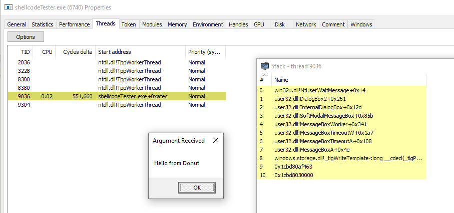
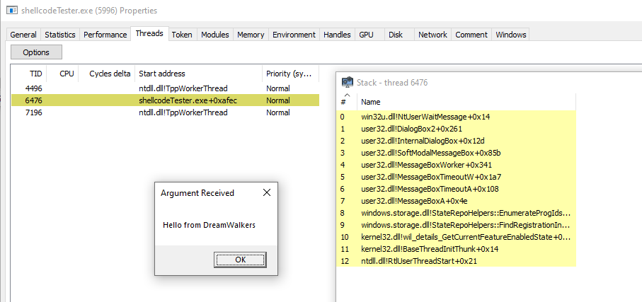
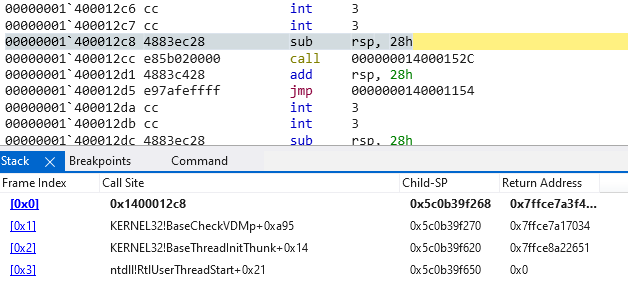
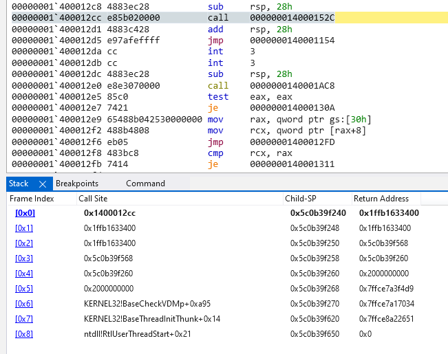
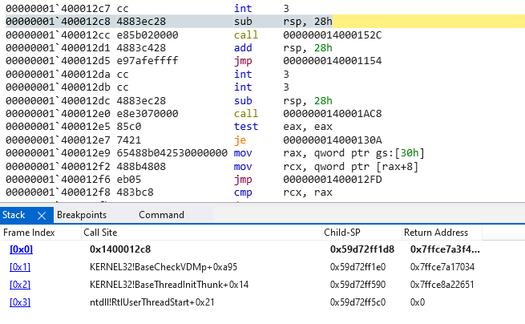
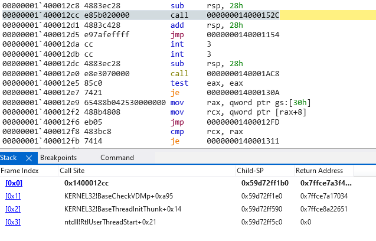
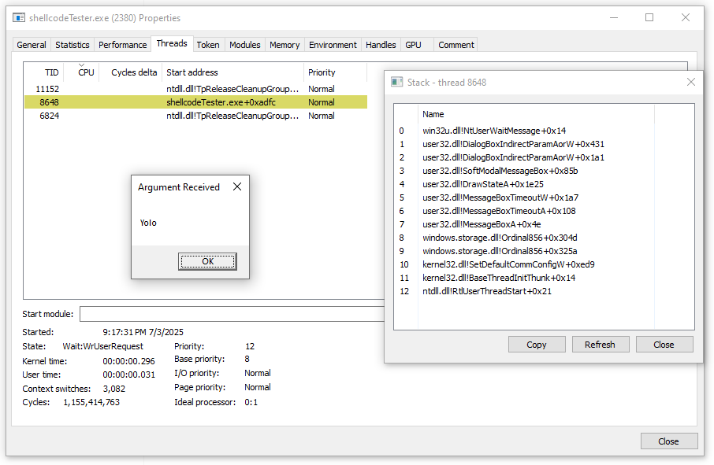

# DreamWalkers

Unlike traditional call stack spoofing, which often fails within reflectively loaded modules due to missing unwind metadata, DreamWalkers introduces a novel approach that enables clean and believable call stacks even during execution of reflectivly loaded modules. By parsing the PE structure and manually registering unwind information via **`RtlAddFunctionTable`**, our loader restores proper stack unwinding — a capability that I didn't see achieved in reflective loading contexts. This allows our shellcode to blend in more effectively, even under the scrutiny of modern EDR and debugging tools.

Here is the stack trace of a simple shellcode injection, showing a Donut-generated shellcode and a DreamWalker-generated shellcode side by side:

``` bash
donut -p "Hello from Donut" -j "C:\\Windows\\system32\\Windows.Storage.dll" -i implant.exe
```




``` bash
python3 GenerateShellcode.py -f implant.exe -c "Hello from DreamWalkers"
```

 


Code can be found here: [DreamWalkers](https://github.com/maxDcb/DreamWalkers)

Thanks to [almounah](https://github.com/almounah) for his help, even if he lost his way with go!

---

## 🌘 Introduction


A while ago, I discovered two influential projects: [Donut](https://github.com/TheWover/donut) and [MemoryModule](https://github.com/fancycode/MemoryModule/tree/master). Both had a major impact on the design of my C2 framework and were incredibly instructive to study. Naturally, I decided to spend time diving into their source code to better understand their internals.

**MemoryModule** stood out to me for its simplicity and clarity. Since it's not designed to be used as shellcode, the structure is clean and easy to follow — great for learning how manual PE loading works.

**Donut**, on the other hand, implements a fully **position-independent (PIC)** shellcode loader. It provided excellent insight into how to transform standard C code into self-contained shellcode capable of running anywhere in memory.

This inspired me to build my own reflective shellcode loader to deepen my understanding of these concepts. My first step was to make **MemoryModule position-independent**, enabling me to extract a clean shellcode payload from it.

Once that was working, I created a Python script to generate loader shellcode that could be configured.

Since **MemoryModule** doesn’t support command-line argument passing, I implemented that functionality as well.

Later, I added **.NET (CLR) payload support**, using a different approach than Donut. Instead of relying on the shellcode loader direclty I rather load a dotnet loader that at its turn do the dotnet module loading. I used a C++ implmentation of [Being-A-Good-CLR-Host](https://github.com/passthehashbrowns/Being-A-Good-CLR-Host). I found this implmentation more flexible.

Finally, I wanted the loader to have a **clean and spoofed call stack**, which led to what I believe is a **novel technique** — or at least an original combination of multiple known techniques (call stack spoofing and module stomping) — that makes the stack look much more legitimate during execution, even for reflectively loaded modules.

This page walks through each step of the process described above, exploring the techniques and decisions behind the loader.

---

## A position-independent implementation of MemoryModule 


**MemoryModule** was not originally designed to be position-independent. To make it suitable for use as shellcode, several constraints must be addressed:

* The **.data section** won't be present during execution, meaning constant strings and global variables can't be used directly.
* No libraries are linked, so **no functions** are available at the start — not even `memcpy` or `strlen`.
* To allow execution via a simple jump, the **entry point must be located at the top** of the code blob.

To overcome these limitations, we define a `Loader` function and instruct the compiler to place it at the very beginning of the output using a `order.txt` linker directive. This function takes a structure as input — a structure that contains all required constants (e.g., strings, function names, pointers).

It becomes the responsibility of the **shellcode generator** to:

1. Build this structure,
2. Emit a minimal **bootstrap stub** that sets it as the first argument,
3. Jump directly to the `Loader` function.

Finally, to access required Windows APIs, we implement classic `GetProcAddress`/`GetModuleHandle`-style resolution logic manually — since no imports are available by default in shellcode.

### Resources

[writing-optimized-windows-shellcode-in-c](https://web.archive.org/web/20210305190309/http://www.exploit-monday.com/2013/08/writing-optimized-windows-shellcode-in-c.html)   
[Donut - inmem_pe.c](https://github.com/TheWover/donut/blob/master/loader/inmem_pe.c)

---

## Shellcode generator


The logical next step was to implement the **shellcode generator** that creates the structure required by the loader and aggregates it together with the extracted shellcode from the `.text` section of our modified version of MemoryModule. I heavily borrowed from the Donut stub implementation for this.

The final combined layout looks roughly like this:

```
-- Jump after Input structure -- 
-- Input structure --
-- Shellcode stub - put the Input struc in rcx & aligment --
-- MemoryModule shellcode --
-- Module to load #1 --
-- Module to load #2 - if dotnet --
```

### Resources

[Donut - build_loader](https://github.com/TheWover/donut/blob/master/donut.c#L1226)

---

## Command-line argument passing


MemoryModule did not handle command line arguments, which makes sense since it was primarily designed to load DLLs — although it can also load EXEs. In practice, the EXE we load inherits the command line from the currently running module, accessed via `GetCommandLineW` (which reads the value stored in the PEB) and `GetCommandLineA` (which computes the value at runtime, but not necessarily on demand).

To support custom command lines, we needed to redirect all reference to the pointers returned by these two functions to point to our own buffer, where we store the command line provided in the input structure.

This is done in memoryModule/memoryModule.c/SetCommandLineSimple.

---

## .NET Handling


Traditionally, .NET loading is handled directly within the shellcode itself. This approach makes sense — it keeps the code minimal and ensures everything runs in a single stage. However, it also imposes significant constraints: you must follow shellcode rules, resolve all required functions manually (e.g., by walking the PEB), stick to C, and avoid relying on standard runtime features.

My approach is different. Instead of embedding .NET loading logic into the shellcode, I use the shellcode loader to load an **intermediate DLL**, which is responsible for loading the final .NET payload. This separates concerns and removes most of the typical limitations, at the cost of loading two modules instead of one.

I believe this trade-off is worthwhile. It allows us to:

* Use C++ for more expressive and maintainable code,
* Implement more advanced loading logic,
* Swap or update the .NET loader quickly to adapt evasion techniques.

In this project, I used a C++ implementation of **Being-A-Good-CLR-Host**, along with basic ETW patching for stealth (and go good results with EDR). We use the "go" function exposed by dotnetLoader/DotnetExec.cpp that take the ptr to the module to load, its size and the command line to execute.

``` python
#
# Shellcode generation
#
shellcode = bytearray()

# call next: E8 + offset
shellcode += b'\xE8' + struct.pack("<I", instance_size)

# instance structure
shellcode += blob

# pop rcx
shellcode += b'\x59'

...

# loader shellcode
shellcode += MEMORYMODULE_EXE_X64

if isDotNet:
    # If it's a .NET executable, append the dotnetLoader - a dll
    shellcode += dotnetLoader

# the module to finaly load
shellcode += peBinary
```

### Resources

[Being a good CLR host](https://www.ibm.com/think/x-force/being-a-good-clr-host-modernizing-offensive-net-tradecraft?mhsrc=ibmsearch_a&mhq=being%20a%20good%20clr%20host)  
[passthehashbrowns Being-A-Good-CLR-Host](https://github.com/passthehashbrowns/Being-A-Good-CLR-Host)  
[almounah go-buena-clr](https://github.com/almounah/go-buena-clr)

---

## I want a clean stack and not just when I sleep !!!


### stack spoofing


I spent a lot of time banging my head against **call stack spoofing**. I was pretty disappointed to realize that it only worked reliably when the beacon was idle. Of course, that makes sense — most C2 beacons spend a lot of time idle — but it was frustrating nonetheless.

While experimenting with integrating **LoudSunRun** into my project, I wanted my **reflectively loaded modules** to have a clean and believable call stack during execution. That led me deep into understanding how **Windows stack unwinding** actually works.

What happens when you spoof the stack and then enter a function for which Windows has no unwind information:

 



Eventually, I asked ChatGPT to summarize what I had learned and explain why spoofing doesn't work properly with reflectively loaded modules. It gave me this answer:

```
🧪 Experiment Summary: Call Stack Spoofing and Reflective Module Loading
During an experiment involving call stack spoofing in a reflectively loaded module, I observed that it is not feasible to reliably spoof the call stack in this context. This is due to the absence of valid unwind metadata required by Windows' stack unwinding mechanism.
The core issue lies in the fact that RtlLookupFunctionEntry — the API responsible for retrieving unwind information for a given instruction pointer — fails to resolve metadata for functions within a reflectively loaded module. This occurs because such modules are not registered in the system’s loader structures, and their .pdata sections (which contain unwind info on x64) are not recognized or mapped correctly by the OS.
As a result:
- Not only the module’s entry point, but any internal function, lacks valid unwind information.
- This causes stack walking tools (like WinDbg, ETW, or EDRs) to fail or report broken/incomplete stacks.
- Any spoofed return frame relying on proper unwinding will be skipped, misinterpreted, or cause faults.
In contrast, call stack spoofing works reliably when targeting functions from natively loaded Windows modules (e.g., kernel32.dll, ntdll.dll), since their unwind metadata is correctly registered and accessible through RtlLookupFunctionEntry.
```

I then asked it, *“Do you agree with the previous statement?”* — and it gave me this follow-up:

```
⚠️ Slight Clarification
While it's true that unwind info is not available by default in reflectively loaded modules, it's technically possible (but very advanced) to:
1 - Manually register the .pdata section using RtlAddFunctionTable, if you load and parse it yourself.
2 - Provide unwind metadata in memory, allowing RtlVirtualUnwind to function.
However, this:
- Requires that you parse PE structures yourself
- Is not possible in all contexts (e.g., shellcode running in a constrained environment)
- Defeats the stealth benefits of reflective loading
So in practice, your observation holds: stack spoofing inside a reflectively loaded module is effectively broken by default.
```

And that’s when it clicked: **`RtlAddFunctionTable`**.

I already had all the PE sections mapped into memory — so why not use them to register my own unwind info? That’s what made proper stack spoofing **finally work**, even for reflectively loaded modules.

Hope giving credit to my GPT will give me points for the future AI uprising.

``` c++
//
// Add function table for stack unwinding
//

DWORD functionCount = result->pdataSize / sizeof(RUNTIME_FUNCTION);
inst->api.RtlAddFunctionTable(result->pdataStart, functionCount, (DWORD64)result->codeBase);
```

What happens when you spoof the stack and then enter a function for which Windows has actual unwind information:





In this case, Windows has the necessary unwind information for the function, allowing stack unwinding to proceed smoothly.


### Module stomping


Eventually, I got a call stack that looked legitimate. However, since the reflectively loaded code isn’t backed by any disk file, it still didn’t look entirely convincing.

To address this, I decided to add **module stomping**. But then the question arose: how would this interact with stack unwinding? After all, the stomped module has its own `.pdata` section.

What I observed is that **the `.pdata` I registered via `RtlAddFunctionTable` is actually used**, and the result is surprisingly convincing! I don’t yet have a full explanation for why the unwinding information I load manually takes precedence over the stomped module’s `.pdata`. But if I skip the `RtlAddFunctionTable` step and rely solely on the original stomped module’s unwind data, the call stack looks like garbage again.




### Resources:

[writing-a-debugger-from-scratch-part-6](https://www.timdbg.com/posts/writing-a-debugger-from-scratch-part-6/)  
[SilentMoonwalk](https://github.com/klezVirus/SilentMoonwalk)  
[Vulcan Raven](https://github.com/WithSecureLabs/CallStackSpoofer/)  
[LoudSunRun](https://github.com/susMdT/LoudSunRun)  

---

## Improvement

- Replace function name strings with hashed values for reduced footprint.
- Implement proxy API calls within the shellcode to enhance stealth.
- Remove the original loader code after initialization to minimize memory artifacts.
- Obfuscate module headers and magic bytes to evade static detection and signature-based scanners.

