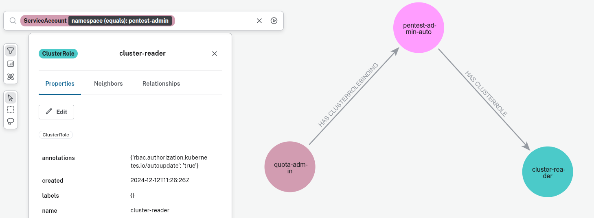
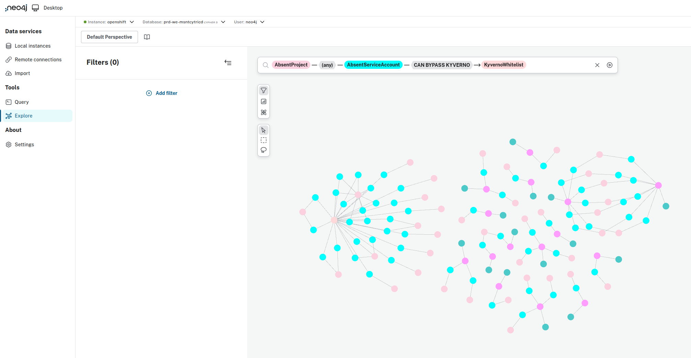
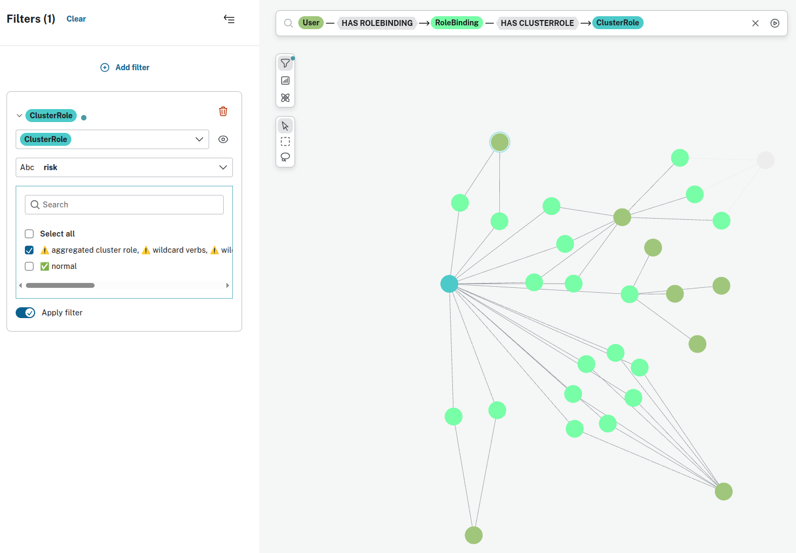
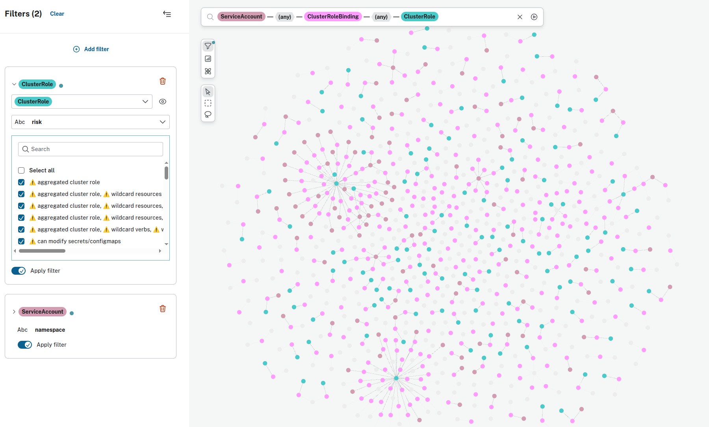
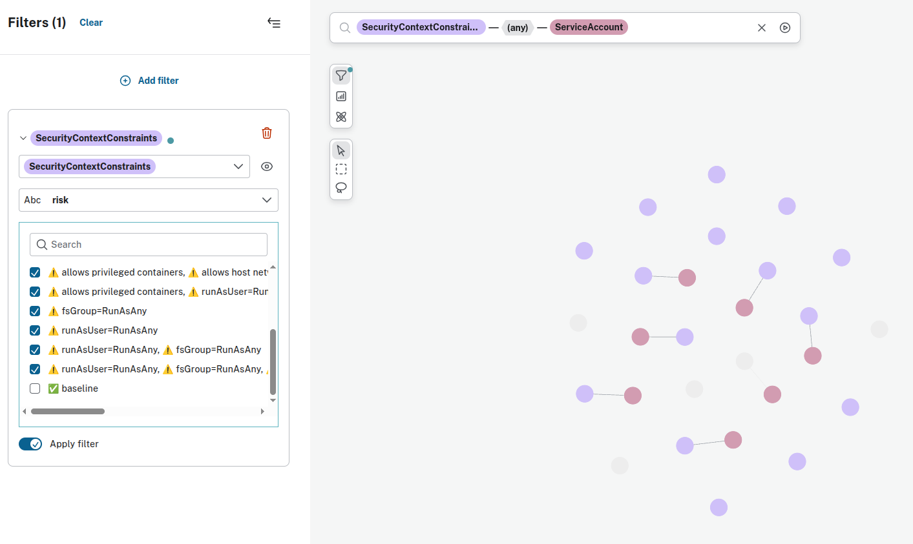
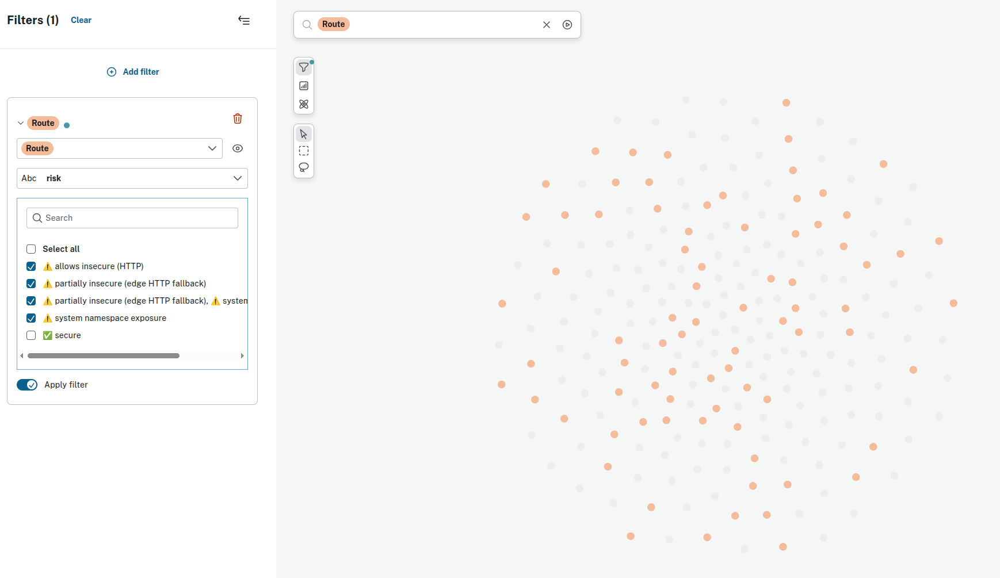

# 🕸 OpenShiftGrapher: Visualizing & Securing Your OpenShift Cluster

OpenShift environments are often complex, and full of hidden security blind spots. **OpenShiftGrapher** is a **security visualization and enumeration tool** that extracts key Kubernetes and OpenShift resources, maps their relations, and makes it easy to identify **risky configurations, privilege escalations, and potential attack paths**.

This tool is designed for:

* 🛡 Red teamers & offensive security testers who need a **cluster overview**
* 🧑‍💻 DevSecOps & platform engineers who want to **continuously monitor cluster exposures**
* 🔎 Any one looking for **impact and privilege propagation**

[👉 View the project on GitHub](https://github.com/AmadeusITGroup/OpenShiftGrapher)

---

## ⚙️ How to Use OpenShiftGrapher

### Install directly from GitHub

The easies way to install the last version of OpenShiftGrapher is to use [Astral's uv](https://docs.astral.sh/uv/):

Either directly from the github to get the last version:

```bash
# using uv
uv venv .venv
source .venv/bin/activate
uv pip install git+https://github.com/AmadeusITGroup/OpenShiftGrapher.git@main
```

From PyPi:

```bash
# using uv
uv venv .venv
source .venv/bin/activate
uv pip install OpenShiftGrapher

# using pip
pip install OpenShiftGrapher
```

### Install Neo4j desktop

OpenShiftGrapher needs to communicate with a Neo4j database, and the OpenShift cluster.

To install the Neo4j database we recommend to install Neo4j desktop, which contain the database and the visualisation:

[Neo4j](https://neo4j.com/download/) 


### Run the grapher

A token with sufficient read privileges across the cluster is required:



The graph is generated using the following command:

```bash
OpenShiftGrapher -a https://api.mycluster.net:6443 -t `cat ./token.txt` -d mycluster -c all
```

It first queries the cluster to enumerate resources and then pushes the collected data into your Neo4j database:

``` bash
(.venv) max:~/OpenShiftGrapher$ OpenShiftGrapher -a https://api.mycluster.net:6443 -t `cat ./token.txt` -d mycluster -c all -r
#### Init OC ####
#### Init neo4j ####
are you sure your want to reset the db? (y/n)y
#### Fetch resources ####
Fetching OAuth
Fetching Identity
Fetching Projects
Fetching ServiceAccounts
Fetching SecurityContextConstraints
Fetching Roles
Fetching ClusterRoles
Fetching Users
Fetching Groups
Fetching RoleBindings
Fetching ClusterRoleBindings
Fetching Routes
Fetching Pods
Fetching Kyverno logs from pods
Fetching ConfigMaps
Fetching ValidatingWebhookConfigurations
Fetching MutatingWebhookConfiguration
Fetching ClusterPolicy
#### OAuth ####
OAuth |################################| 1/1
#### Identities ####
Identities |################################| 115/115
#### Project ####
Project |################################| 191/191
#### Service Account ####
Service Account |################################| 941/941
#### SecurityContextConstraints ####
SecurityContextConstraints |################################| 19/19
#### Role ####
Role |################################| 449/449
#### ClusterRole ####
ClusterRole |################################| 853/853
#### User ####
User |################################| 115/115
#### Group ####
Group |################################| 8289/8289
#### RoleBinding ####
RoleBinding |################################| 1395/1395
#### ClusterRoleBinding ####
ClusterRoleBinding |################################| 434/434
#### Route ####
Route |################################| 236/236
#### Pod ####
Pod |################################| 1547/1547
#### ConfigMap ####
ConfigMap |################################| 2710/2710
#### Kyverno ####
Kyverno |################################| 3/3
#### ValidatingWebhookConfiguration ####
ValidatingWebhookConfiguration |################################| 28/28
#### MutatingWebhookConfiguration ####
MutatingWebhookConfiguration |################################| 10/10
#### ClusterPolicy ####
ClusterPolicies |################################| 14/14
```

### Visualize the graph

With Neo4j, you can get creative with data visualization to uncover potential security issues in your OpenShift cluster.
Below are two simple examples using the "Explore" tool:

1. Absent ServiceAccounts that could bypass Kyverno policies if created:



2. Users with ClusterRoles associated with elevated risks:



---


## 🧩 Enumerated Resources & Security Impact

OpenShiftGrapher extracts key cluster resources that shape the **security posture** of an OpenShift environment.

---

### 🧑‍🤝‍🧑 **Access Control & Identity (RBAC / Users)**

| Resource                  | Description                                                 | Security Impact                                                                                    | Risks                                  |
| ------------------------- | ----------------------------------------------------------- | -------------------------------------------------------------------------------------------------- | -------------------------------------- |
| `user`               | Represents human or system users recognized by the cluster. | Users define the identity surface of the cluster. | Privilege escalation, account takeover |
| `group`              | Logical grouping of users.                                  | Group-based permissions can multiply access quickly if not controlled.                             | Accidental privilege propagation       |
| `serviceAccount`     | Machine identities used by pods or controllers.             | Compromised SAs often lead to privilege escalation through token theft.                            | Lateral movement, persistence          |
| `role`               | Namespaced RBAC definitions.                                | Roles define fine-grained privileges. Over-privileged roles expose sensitive resources.            | Namespace compromise                   |
| `clusterrole`        | Cluster-wide RBAC definitions.                              | ClusterRoles enable permissions across all namespaces. Misuse is a critical attack vector.         | Full cluster compromise                |
| `roleBinding`        | Binds roles to users/groups/service accounts.               | Determines who gets what at namespace level.                                                       | Over-binding → privilege creep         |
| `clusterRoleBinding` | Binds ClusterRoles globally.                                | A single misconfigured CRB can give cluster-admin rights.                                          | Privilege escalation to cluster-admin  |

🔸 **Security note:** RBAC is often the **first target** for attackers after gaining a foothold. Over-privileged bindings or leaked service account tokens can open direct paths to escalation.

---

### 🔐 **Authentication & Authorization**

| Resource        | Description                                                 | Security Impact                                                                        | Risks                                 |
| --------------- | ----------------------------------------------------------- | -------------------------------------------------------------------------------------- | ------------------------------------- |
| `oauth`    | OAuth configuration for cluster authentication.             | Weak or misconfigured OAuth providers can allow unauthorized access.                   | Unauthorized login, account takeover  |
| `identity` | Maps identities from external providers to OpenShift users. | Improper mapping can result in privilege misassignment.                                | Impersonation, privilege escalation   |
| `project`  | Namespaces - OpenShift “projects”.                          | Projects define isolation boundaries. |  |

🔸 **Security note:** Compromising authentication or identity mapping can bypass other controls entirely.

---

### 🧱 **Admission Control & Policy Enforcement**

| Resource                              | Description                                                        | Security Impact                                                  | Risks                                 |
| ------------------------------------- | ------------------------------------------------------------------ | ---------------------------------------------------------------- | ------------------------------------- |
| `SecurityContextConstraints`   | Controls runtime security of pods (privileged mode, host access…). | Weak SCCs allow container escape and host access.                | Root access, persistence              |
| `validatingWebhookConfiguration` | Webhooks that enforce policies on object creation/update.          | Missing or weak validation allows risky objects to be created.   | Evasion of security guardrails        |
| `mutatingWebhookConfiguration`   | Webhooks that can modify objects on admission.                     |  |                  |
| `clusterPolicy`                  | Kyverno cluster-wide policies.                                     | These define compliance and enforcement posture.                 | Weak policy coverage → attack surface |
| `kyverno`                        | Observed policy enforcement.                        | Useful for identifying possible bypass.   | Misconfigurations          |

🔸 **Security note:** Admission control is a **powerful defense layer**. Attackers may seek to bypass webhook configurations or exploit weak SCCs to escalate privileges.

---

### 🌐 **Network Security & Isolation**

| Resource     | Description                 | Security Impact                                                                                     | Risks                             |
| ------------ | --------------------------- | --------------------------------------------------------------------------------------------------- | --------------------------------- |
| `route` | OpenShift Routes (Ingress). | Exposes internal services externally. Misconfiguration can leak sensitive apps or bypass auth.      | Missconfiguration |
| `pod`   | Running workloads.          | Pods are often initial footholds. If privileged or connected to sensitive networks, attacker can pivot or escalate. | Lateral movement, token theft, privilege escalate     |

🔸 **Security note:** Network exposures are often **entry points** or **pivot routes** in an attack path. Route and Pod visibility is key to identifying vulnerable surfaces.

---

## 🧠 Putting It All Together

These resources are not isolated — they **interconnect to form attack paths**:

* A **Pod** with an over-privileged **ServiceAccount** can leverage a **ClusterRoleBinding** to become cluster-admin.
* A weak **SCC** can enable container escape, followed by reading secrets from other **Projects**.
* A misconfigured **Route** can expose sensitive workloads to the internet, bypassing internal-only expectations.
* An attacker can exploit gaps in **ValidatingWebhook** or **Kyverno policy** to deploy malicious workloads unnoticed.

### Explore visualisation

Here are some example queries to help spot risky configurations and privilege relationships in your OpenShift cluster:

1. ServiceAccounts with ClusterRoles that are not part of OpenShift projects:



2. SecurityContextConstraints associated with risks:



3. Routes associated with risks:



### Query tool

Neo4j Desktop also includes a powerful query system that allows you to automate the discovery of known risky configurations and security misconfigurations.

1. ServiceAccounts that can use risky SecurityContextConstraints

This query identifies ServiceAccounts linked to SCCs that may allow container breakout (e.g., privileged SCC):

```
MATCH (sa:ServiceAccount)-[:`CAN USE SecurityContextConstraints`]->(scc:SecurityContextConstraints)
WHERE scc.allowHostNetwork = true 
   OR scc.allowHostPID = true 
   OR scc.allowPrivilegeEscalation = true
RETURN sa.name AS ServiceAccount, scc.name AS SCC, 
       scc.allowHostNetwork, scc.allowHostPID, scc.allowPrivilegeEscalation
ORDER BY sa.name
```

---

## 🛡️ Defensive Takeaways

* Apply **least privilege RBAC** principles to users, groups, and service accounts.
* Strengthen **SCC** configurations and enforce admission control with **webhooks / Kyverno**.
* Audit **Routes** and **Pods** regularly for unintended exposure or lateral movement paths.
* Continuously **visualize and correlate** these resources to understand your real attack surface.

---

## Conclusion

A relational graph provides one of the most effective ways to visualize OpenShift and, more broadly, Kubernetes infrastructures.
By mapping resources, identities, and their relationships, we can reveal patterns that are often hidden in traditional command-line or YAML-based views. This visual layer makes it easier to understand complex permission models, network exposure points, and policy enforcement gaps at a glance.

However, visualization is only the first step. The real value comes from what you do with it:
- Crafting targeted queries to surface high-risk configurations.
- Identifying attack paths that span multiple layers (e.g., RBAC, SCC, Routes).
- Correlating technical elements with organizational context to prioritize remediation.
- Tracking how your security posture evolves over time.

Every environment is unique. That’s why OpenShiftGrapher is designed to be flexible and extensible. You can adapt or extend the data collection scripts to add contextual information, integrate with threat models, or enrich the graph with risks specific to your organization. This transforms the tool from a simple visualization engine into a powerful decision-support system for security teams, platform engineers, and red team operators.

Whether you’re defending your infrastructure or testing it, combining graph-based visibility with targeted analysis is a strategic way to surface critical security issues before they’re exploited.